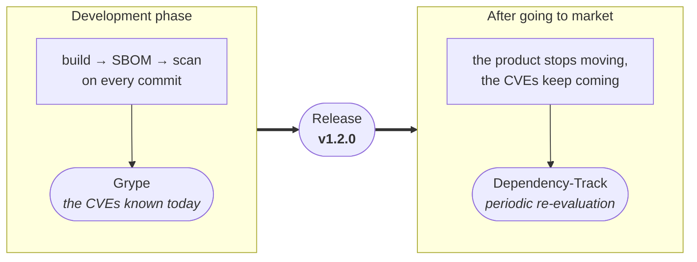
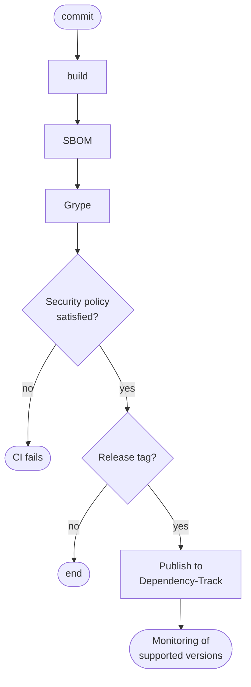

# Generating an SBOM is not enough: monitor it with Dependency-Track

> **CRA & Dev #5** · ["CRA & Dev" series](index.md) · Reading time: about 5 min · CI/CD, cross-platform ·
> Tools: Grype, Dependency-Track

[Episode 1](CRA-Dev-01-SBOM-VEX.md) produces a CycloneDX SBOM on every build. What
remains is the question that actually matters:

> does a vulnerability published today affect a version of our product that is still
> supported?

Answering it means checking at two distinct moments: during development, for the
flaws already known when the build runs, and after the product reaches the market,
for those discovered later in components already shipped.



The CRA requires handling vulnerabilities throughout the support period, but it
mandates neither a tool nor a severity threshold. Everything below is an
implementation choice.

## The classic trap

The pipeline generates a SBOM, archives it, and never opens it again:

```text
build → SBOM → archive → forgotten
```

That inventory is dated, it is not a process. A CVE published three months later
triggers no analysis, and nobody knows which versions are affected.

The other mistake is overwriting the same `latest` project every time. The link
between a shipped version, its artifact and its exact composition is then lost.

## The technique: check now, monitor afterwards



Every commit is checked, but only versions actually shipped enter the portfolio for
good. That keeps it from filling up with branches and throwaway builds.

### 1. Set Grype's failure threshold

Grype consumes the CycloneDX SBOM from the build directly, with no conversion:

```bash
grype sbom:bom.json --fail-on high
```

That threshold is not a CRA requirement. It follows the product's exposure, whether a
fix exists, and the remediation delay you set yourself. The syntax of `--fail-on` is
described in the [Grype reference][grype].

A scan is only worth the SBOM feeding it. Check at minimum that every component
carries a name, a version and a Package URL (`purl`): without a `purl`, matching
against vulnerability databases becomes guesswork.

### 2. Publish to Dependency-Track

The API takes the project name and version, and can create the project on first
upload. In GitHub Actions, the repository name and the tag are enough as identifiers:

```yaml
env:
  PROJECT_NAME: ${{ github.event.repository.name }}
  PROJECT_VERSION: ${{ github.ref_name }}
```

The upload is then a single request:

```bash
curl --fail-with-body --request POST "$DTRACK_URL/api/v1/bom" \
  --header "X-Api-Key: $DTRACK_API_KEY" \
  --form "autoCreate=true" \
  --form "projectName=$PROJECT_NAME" \
  --form "projectVersion=$PROJECT_VERSION" \
  --form "bom=@bom.json"
```

The `--fail-with-body` option fails the job on an HTTP error response while keeping
the server's message. Import parameters are described in the [Dependency-Track CI/CD
documentation][dtrack-ci].

This is where post-market monitoring happens: [Dependency-Track][dtrack] periodically
re-evaluates the components in its portfolio. A published version can therefore raise
a new alert without being rebuilt. The frequency depends on your instance, see its
[recurring tasks][dtrack-tasks].

### 3. Protect the API key

The key is a secret, and belongs in the CI secret manager:

```yaml
env:
  DTRACK_API_KEY: ${{ secrets.DTRACK_API_KEY }}
  DTRACK_URL: ${{ vars.DTRACK_URL }}
```

Use a team and a key dedicated to CI, with least privilege. Upload requires
`BOM_UPLOAD`; with `autoCreate=true`, it also requires `PROJECT_CREATION_UPLOAD`, as
listed in the [permissions reference][dtrack-perms].

## A scanner result is not proof of exploitability

Grype matches components against security advisories. That match does not prove the
flaw is reachable in your product: the code may be unreachable, the feature disabled,
a compensating control in place. The result therefore feeds a triage, whose
conclusion is documented in VEX, as covered in
[episode 1](CRA-Dev-01-SBOM-VEX.md).

## Three things to know

1. A SBOM is not a scanner. It describes the product's composition; another tool
   matches that composition against known vulnerabilities.
2. A scan is only worth its data at that moment. The vulnerability database must be
   current, and versions already shipped must stay under watch.
3. Severity alone doesn't decide. Exposure, the availability of a fix and your risk
   policy weigh as much as the score.

## Takeaway

An archived SBOM is a compliance record, a published and re-evaluated SBOM is an
operational tool. Check every build against an explicit policy, and keep watching
the versions still deployed. This chain improves visibility, it does not make a product safe: it sees neither flaws in your
own code, nor misconfigurations, nor exposed secrets. And an alert with no owner and
no triage deadline is still noise.

---

*Previous episode: [Trust, but verify](CRA-Dev-04-Integrite.md).*

[grype]: https://oss.anchore.com/docs/reference/grype/configuration/
[dtrack]: https://dependencytrack.org/
[dtrack-ci]: https://docs.dependencytrack.org/usage/cicd/
[dtrack-tasks]: https://docs.dependencytrack.org/getting-started/recurring-tasks/
[dtrack-perms]: https://docs.dependencytrack.org/administration/users-and-permissions/
