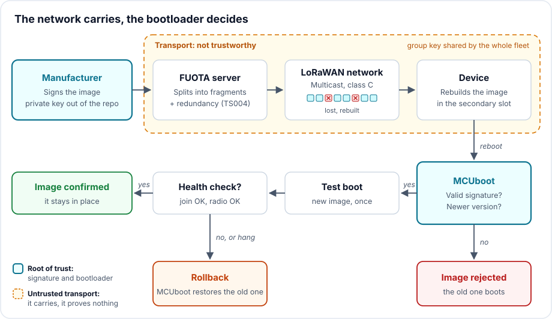

# A thousand fragments, one signature: updating firmware over LoRaWAN

> **CRA & Dev #6** · ["CRA & Dev" series](index.md) · Reading time: about 9 min · Embedded (ESP32), LoRaWAN ·
> Tools: Zephyr, MCUboot, imgtool

## What the CRA requires

A product must be fixable after it is placed on the market. The [Cyber Resilience
Act][cra] requires that vulnerabilities can be addressed through security updates, automatic
where applicable (Annex I, Part I, point 2, c), and that the manufacturer has
mechanisms to distribute those updates securely (Part II, point 7), without delay
(point 8).

On a server, that is an HTTPS download. On a LoRaWAN sensor sitting on top of a pole
for ten years, running on a battery, it is a different trade. The network carries a
few dozen bytes per frame, the device almost never listens, and nobody will go and
reflash it by hand. The answer is called FUOTA (*Firmware Update Over The Air*), and
it does not exempt you from signing what you send.

## The classic trap

Three mistakes, all common.

Believing LoRaWAN encryption authenticates the firmware. To update a fleet, you
broadcast the fragments over multicast, encrypted with a group key. By construction,
that key is identical in every device of the group. Opening one device is enough to
extract it, and then to craft fragments every other device will accept. The
[fragmentation specification][ts004] says so itself (section 4): those keys cannot be
considered safe, an additional file integrity and authentication step is needed, and
for firmware the recommended solution is a public-key signature. This is exactly the
criterion from [episode 4](CRA-Dev-04-Integrite.md): when whoever verifies must not
be able to forge, a shared secret is no longer enough.

Sending the full image without doing the maths. A [study from University College
Cork][fuota-paper] works it out for a 50 kB image at DR2 (SF10), meaning 51 usable
bytes per frame: about 1,004 downlinks, and around 17 hours for a single device
because of the 1% duty-cycle limit in Europe. Without multicast, a whole fleet takes
weeks.

Not planning for failure. An incomplete image, or a complete one that does not boot,
and the sensor is lost. Without automatic rollback, every update is a gamble.

## The technique: separate transport from trust

The principle fits in one sentence: the network carries, the bootloader decides. Let
LoRaWAN move bytes, and only boot what carries a valid signature.



### 1. Transport: three standard building blocks

The LoRa Alliance split FUOTA into independent application-layer packages, each on
its own port.

| Building block | Specification | Port | Role |
| --- | --- | --- | --- |
| Clock synchronization | [TS003][ts003] | 202 | Set the devices' clocks, so they open their receive window at the same moment |
| Multicast setup | [TS005][ts005] | 200 | Hand each device the group key and the session time (class B or C) |
| Fragmented transport | [TS004][ts004] | 201 | Split the image into fragments, plus redundant fragments |

A session goes like this (figure 3 of the [study cited above][fuota-paper]). The server configures each device over unicast (multicast
group, fragmentation session, start time). At the agreed time, all of them switch to
class C and listen continuously. The server broadcasts the fragments once for the
whole group. The devices rebuild the image, then return to class A.

Redundancy avoids retransmissions. The extra fragments are combinations of the
original ones: according to the specification, 10% redundancy lets a device lose
roughly 10% of the frames and still rebuild the file, without asking the server for
anything.

### 2. Trust: sign the image, verify at boot

With [MCUboot][mcuboot-design], the signature is part of the image. The bootloader
holds the public key and refuses to boot an image whose signature does not match,
whichever path it arrived through.

Generate the key pair once, with [`imgtool`][imgtool].

```bash
# ECDSA P-256 key pair (ed25519 and RSA are supported too)
imgtool keygen -k fuota-ecdsa-p256.pem -t ecdsa-p256
```

Then configure the bootloader in `sysbuild.conf`, and pass the key at build time, so
that its path stays out of the repository. The build signs the application and
embeds the public key in MCUboot. The commands are those of the
[example firmware][example], here for a Heltec WiFi LoRa 32 board (ESP32 and SX1276
radio).

```ini
# sysbuild.conf
SB_CONFIG_BOOTLOADER_MCUBOOT=y
SB_CONFIG_BOOT_SIGNATURE_TYPE_ECDSA_P256=y
SB_CONFIG_MCUBOOT_MODE_SWAP_SCRATCH=y   # slot swap: rollback is possible
```

```bash
west build -b heltec_wifi_lora32_v2/esp32/procpu --sysbuild firmware -- \
  -DSB_CONFIG_BOOT_SIGNATURE_KEY_FILE='"/path/outside-the-repo/fuota-ecdsa-p256.pem"'
# Image to hand to the FUOTA server: build/firmware/zephyr/zephyr.signed.bin
```

That signed file is what the server fragments. The signature travels in the
fragments, like everything else.

### 3. On the device: receive, reboot, confirm

The example firmware relies on the same services as Zephyr's [FUOTA
sample][zephyr-fuota]. A few options enable the three building blocks.

```ini
# prj.conf (excerpt)
CONFIG_LORAWAN_SERVICES=y
CONFIG_LORAWAN_APP_CLOCK_SYNC=y      # TS003
CONFIG_LORAWAN_REMOTE_MULTICAST=y    # TS005
CONFIG_LORAWAN_FRAG_TRANSPORT=y      # TS004
CONFIG_IMG_MANAGER=y                 # writes to the secondary slot
CONFIG_REBOOT=y
```

The application code starts the services, reacts when the image is complete, and
decides whether a new image deserves to be kept (excerpt from
`firmware/src/main.c`).

```c
/* Called once the image is rebuilt in the secondary slot.
 * Zephyr has already asked MCUboot for a "test" boot. */
static void fuota_finished(void)
{
	k_sem_give(&image_received); /* the main loop will reboot */
}

int main(void)
{
	bool confirmed = boot_is_img_confirmed();
	bool joined;

	/* ... lorawan_start() ... */
	joined = join() == 0;

	/* The health check. A test image that fails it reboots without
	 * confirming itself: MCUboot puts the old one back. */
	if (!confirmed) {
		if (!joined) {
			sys_reboot(SYS_REBOOT_COLD);
		}
		boot_write_img_confirmed();
	}

	lorawan_clock_sync_run();                   /* TS003 */
	lorawan_frag_transport_run(fuota_finished); /* TS004 */
	/* TS005 starts on its own, in the background */

	/* ... regular uplinks: in class A, they are what opens the receive
	 * windows the server needs. Then, once image_received is given:
	 * sys_reboot(SYS_REBOOT_COLD) ... */
}
```

On reboot, MCUboot [verifies the signature][mcuboot-design] of the received image
before swapping it with the old one. A forged, truncated or badly rebuilt image never boots.

### 4. Confirm, or roll back

Zephyr [requests the upgrade in test mode][zephyr-frag-flash] (`BOOT_UPGRADE_TEST`).
The new image boots once. If it does not call `boot_write_img_confirmed()`, MCUboot [puts the old one
back][mcuboot-design] at the next reset. Hence the point of confirming late, after a real health check,
here the successful join, and of letting a watchdog trigger the reset if the firmware
hangs before that.

That leaves the malicious rollback: replaying an old image, correctly signed, but
vulnerable. MCUboot [describes two protections][mcuboot-design]. The first compares
version numbers (`CONFIG_MCUBOOT_DOWNGRADE_PREVENTION`). Its documentation restricts
it to the overwrite strategy; with the MCUboot shipped by Zephyr 4.4.2, we
nevertheless saw it work with slot swapping too. Check on your version. The second relies on
a security counter stored in hardware (`CONFIG_MCUBOOT_HW_DOWNGRADE_PREVENTION`) and
rejects any image whose counter is lower. An equal value passes: so bump the counter
with every security fix.

The example's [test bench][example] drops into the secondary slot of a real board a
forged image, an image with one flipped bit, an old version and an update unable to
join the network. The bootloader and firmware console answers, in that order (the
firmware logs in French: "reboot: test image unable to join the network"):

```
E: Image in the secondary slot is not valid!
I: Image 0 in slot 1 erased due to downgrade prevention
<wrn> fuota: Redémarrage : image à l'essai incapable de rejoindre le réseau
I: Image index: 0, Swap type: revert
```

## Three things to know

1. Count your airtime before writing code. The image size sets the duration and the
   energy cost. In the study cited above, an update at DR0 (SF12) takes almost 30
   times longer than at DR5 (SF7), but DR5 only reaches 45% of the devices in the
   simulated deployment. The levers are well known: a small image, an incremental
   update rather than a full one ([recommended by The Things Stack][tti-fuota]), a
   fragment size matched to the lowest data rate in the group. With a delta, the
   signature must cover the rebuilt image, not the patch. Count RAM too: Zephyr's
   decoder reserves its memory [according to image size, fragment size and
   redundancy][zephyr-frag-kconfig]. With the defaults, it asked for more than 5 MB
   on our ESP32, which offers 192 KB.
2. Replace the default key. Without `SB_CONFIG_BOOT_SIGNATURE_KEY_FILE`, the build
   uses the example key shipped in the public MCUboot repository, whose
   [documentation][mcuboot-zephyr] stresses that the private key is available to all. And as with Authenticode
   ([episode 2](CRA-Dev-02-Authenticode.md)), yours lives neither in the repository
   nor in plaintext in CI. Check your board's defaults too: for the example's Heltec
   board, Zephyr [disables the signature][heltec-sysbuild], and MCUboot on ESP32
   [does not validate the primary slot and overwrites without
   rollback][mcuboot-esp32].
3. The signature does not protect everything. A compromised device of the group can
   still read the broadcast firmware and inject fragments to make the session fail,
   since it holds the group keys ([TS004][ts004], section 4).
   It cannot get its own code to boot. If the firmware is confidential, MCUboot can
   also handle [encrypted images][mcuboot-enc]. And the code that receives the fragments is itself
   an attack surface: [CVE-2026-13480][cve] is an out-of-bounds read in Zephyr's
   TS004 decoder, fixed in 4.4.2. Tracking the vulnerabilities of your radio stack is
   the subject of [episode 1](CRA-Dev-01-SBOM-VEX.md).

## Takeaway

On LoRaWAN, updating is a matter of radio budget and trust. The FUOTA specifications
settle the first: clock, multicast, redundant fragments. They leave the second to the
manufacturer. Sign the image, have the bootloader verify it, confirm it only once it
has proven itself, and forbid going back to a vulnerable version. That is what turns
a channel of a few bytes into a secure update mechanism in the CRA's sense.

---

*Previous episode: [Generating an SBOM is not enough, monitor it with
Dependency-Track](CRA-Dev-05-SBOM-DTRACK.md).*

*Companion code, in [`examples/06-fuota-lorawan`][example]: a full simulated FUOTA
session with its tests, and the complete Zephyr firmware, with its test bench on a
Heltec ESP32 board.*

*Going further: the IETF's [firmware update architecture for IoT][rfc9019] (RFC 9019),
and [version 2.0.0 of TS004][ts004-v2] published in 2022 (the Zephyr sample and
[AWS IoT Core for LoRaWAN][aws-fuota] implement 1.0.0).*

[ts003]: https://resources.lora-alliance.org/technical-specifications/ts003-2-0-0-application-layer-clock-synchronization
[ts004]: https://resources.lora-alliance.org/technical-specifications/lorawan-fragmented-data-block-transport-specification-v1-0-0
[ts004-v2]: https://resources.lora-alliance.org/technical-specifications/ts004-2-0-0-fragmented-data-block-transport
[ts005]: https://resources.lora-alliance.org/technical-specifications/lorawan-remote-multicast-setup-specification-v1-0-0
[fuota-paper]: https://arxiv.org/abs/2002.08735
[zephyr-fuota]: https://docs.zephyrproject.org/latest/samples/subsys/lorawan/fuota/README.html
[mcuboot-design]: https://docs.mcuboot.com/design.html
[imgtool]: https://docs.mcuboot.com/imgtool.html
[tti-fuota]: https://www.thethingsindustries.com/docs/concepts/features/lorawan/fuota/
[aws-fuota]: https://docs.aws.amazon.com/iot-wireless/latest/developerguide/lorawan-mc-fuota-overview.html
[cve]: https://github.com/zephyrproject-rtos/zephyr/security/advisories/GHSA-845m-2m84-g5h2
[rfc9019]: https://www.rfc-editor.org/rfc/rfc9019
[example]: https://github.com/ADNTIO/cra-dev-wiki/tree/main/examples/06-fuota-lorawan
[heltec-sysbuild]: https://github.com/zephyrproject-rtos/zephyr/blob/v4.4.2/boards/heltec/heltec_wifi_lora32_v2/Kconfig.sysbuild
[mcuboot-esp32]: https://github.com/zephyrproject-rtos/mcuboot/blob/6d3b3d2c38ab20c242e5b9abb04d050086383eb2/boot/zephyr/socs/esp32_procpu.conf
[zephyr-frag-kconfig]: https://github.com/zephyrproject-rtos/zephyr/blob/v4.4.2/subsys/lorawan/services/Kconfig
[cra]: https://eur-lex.europa.eu/eli/reg/2024/2847/oj?locale=en
[zephyr-frag-flash]: https://github.com/zephyrproject-rtos/zephyr/blob/main/subsys/lorawan/services/frag_flash.c
[mcuboot-zephyr]: https://docs.mcuboot.com/readme-zephyr.html
[mcuboot-enc]: https://docs.mcuboot.com/encrypted_images.html
