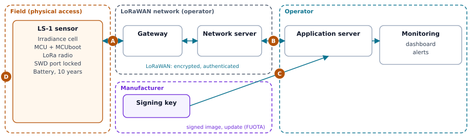

# Assessing the cybersecurity risks of a product

> **CRA & Dev #7** · ["CRA & Dev" series](index.md) · Reading time: about 8 min · All platforms ·
> Example: two assessments in Markdown and PDF

## What the CRA requires

Before you sign a binary or encrypt a secret, you need to know what you are protecting
against. That is the job of the risk assessment, and the [Cyber Resilience Act][cra]
makes it the starting point of everything else: it is what says which Annex I
requirements apply to your product, and how you meet them.

Article 13 sets out what it must contain, at a minimum.

- **An analysis of the risks**, "based on the intended purpose and reasonably
  foreseeable use, as well as the conditions of use": where the product will be
  installed, what needs protecting, how long it will be in service (paragraph 3).
- **A review of the Annex I requirements**, Part I, point 2, from (a) to (m): for
  each one, say whether it applies and how you implement it. If you leave one out,
  you need "a clear justification" (paragraphs 3 and 4).
- **How you apply** point 1 of Part I (a security level appropriate to the risks)
  and the vulnerability handling of Part II (paragraph 3).
- **A living document**: it guides the product from design to maintenance
  (paragraph 2), goes into the technical documentation (paragraph 4), and stays up
  to date throughout the support period, the time during which you handle the
  product's vulnerabilities: at least five years, unless the product is expected to
  be in use for less (paragraphs 3 and 8).

The regulation, however, imposes no method. Choosing one that suits your product is
up to you, and that is what the rest of this page is about.

## The classic trap

You download a template, fill it in one afternoon for the audit, and never touch it
again. The document describes "a connected product" in general, not yours, and it is
already wrong by the next release. A useful assessment is the opposite: short,
specific to your product, and stored in the repository, next to the code it
justifies.

## The four-question approach

The [Threat Modeling Manifesto][tmm] boils the whole approach down to four simple
questions. By answering them, you lay the groundwork for what Article 13 asks for;
you still have to document whether each Annex I requirement applies, and keep the
assessment up to date.

1. **What are we working on?** Describe the product as it will really be used,
   misuse included: in which environment (a workshop, a living room, a pole
   outdoors), with which assets to protect (the firmware, the keys, the data, the
   essential function) and for how many years. Draw the data flows and the trust
   boundaries: one page is enough.
2. **What can go wrong?** Go through each interface and each flow of the diagram,
   and ask who could turn it against you. A checklist helps you miss nothing:
   [STRIDE][stride] covers six families of threats (spoofing, tampering,
   repudiation, information disclosure, denial of service, elevation of privilege).
   For an embedded device, add MITRE's [EMB3D][emb3d] catalogue.
3. **What are we going to do about it?** Rate each risk by likelihood and impact;
   three levels are enough. Then decide: either a measure, which you tie to the
   Annex I point it covers, or accepting the risk, with its justification.
4. **Did we do a good enough job?** Have the analysis reviewed by someone who did
   not write it. Then update it with each release, and whenever a vulnerability
   changes the picture (Article 13, paragraph 7).

### Finding the trust boundaries

Draw the blocks of the system, then group them by who controls them: the field,
where anyone can touch the device; the operator's network; the operator's servers;
the manufacturer's workstation. Every arrow that crosses a dashed line crosses a
trust boundary. That is where most threats hide, and where you apply the STRIDE
checklist first.



For this LoRaWAN sensor, there are four:

- **A**, the radio link between the sensor and the gateway: anyone can listen, jam
  or transmit;
- **B**, the data reaching the operator: the network operator is a third party;
- **C**, a signed update arriving from the manufacturer;
- **D**, physical access to the sensor, on its pole.

## Choosing a method

| Method | What it is | When to choose it | Access |
| --- | --- | --- | --- |
| [STRIDE][stride] (Microsoft) | Checklist of six threat categories, applied to the data flow diagram | Starting point for any development team | Free |
| [EMB3D][emb3d] (MITRE) | Knowledge base of threats and mitigations specific to embedded devices | Firmware and hardware, on top of STRIDE | Free |
| [LINDDUN][linddun] | Privacy threats | Product that processes personal data | Free |
| [EBIOS Risk Manager][ebios] (ANSSI) | Full method in five workshops, from risk sources to operational scenarios | Critical product, a case to argue before management or customers | Free, FR and EN |
| [NIST SP 800-30][nist] | Generic guide: vocabulary, scales, process | Structuring the ratings and the vocabulary | Free |
| [IEC 62443-4-1][iec] | Secure development lifecycle; requirement SR-2 asks for a threat model per product | Industrial product, customer requiring IEC 62443 | Paid |
| [ISO/IEC 27005][iso] | Information security risk management | Risks of the organisation (ISO 27001 ISMS) rather than of the product | Paid |
| [EN 40000-1-2][en40000] | Horizontal harmonised standard for the CRA: principles, product risk management, lifecycle activities | Aiming for presumption of conformity, once the standard is published | Being standardised |

**How to choose?**

- **It is your first exercise, and the team is small**: start with the four
  questions and STRIDE, plus EMB3D if the product is embedded. A few hours are
  enough for a first version that answers what Article 13 asks for.
- **The product processes personal data**: add LINDDUN.
- **You sell to industry**: start from IEC 62443-4-1, which your customers already
  know.
- **The product is critical, or you need to convince management or customers**:
  EBIOS RM gives you a complete framework and a well-argued case.
- **You are aiming for presumption of conformity**: a product that conforms to a
  harmonised standard whose reference is published in the Official Journal is
  presumed to conform to the requirements it covers (Article 27). EN 40000-1-2 is
  still being standardised, and its reference is not published in the Official
  Journal.

## A template to copy

Keep it in Markdown in the repository: it will be reviewed in pull requests, just
like the code.

```markdown
# Risk assessment: <product> <version>

## 1. Context
- Intended purpose:
- Reasonably foreseeable use:
- Conditions of use, environment:
- Assets to protect:
- Expected time in use, support period:
- Interfaces and flows (diagram):

## 2. Risks
| # | Threat: who, through what | Likelihood | Impact | Decision | Measure or justification |
| --- | --- | --- | --- | --- | --- |

## 3. Annex I, Part I, point 2
| Point | Applicable? | Implementation, or justification if not applicable |
| --- | --- | --- |
| (a) no known exploitable vulnerability | | |
| … | | |
| (m) removal of data and settings | | |

## 4. Annex I, Part I, point 1, and Part II
- Target cybersecurity level and why:
- Vulnerability handling (SBOM, contact, updates):

## 5. History
| Date | Version | Change |
| --- | --- | --- |
```

!!! example "A complete example: the LoRaWAN sunlight sensor"

    The full assessment of a fictional LoRaWAN sensor, filled in with this template:
    context, diagram, seven risks, Annex I table.
    [Read online](ressources/exemples/evaluation-risques-capteur-ensoleillement.md) ·
    [PDF](ressources/exemples/evaluation-risques-capteur-ensoleillement.pdf)

    For comparison, the same approach on a product with higher stakes, a water level
    probe for public reservoirs, on which a firefighting reserve may depend:
    [read online](ressources/exemples/evaluation-risques-sonde-niveau-eau.md) ·
    [PDF](ressources/exemples/evaluation-risques-sonde-niveau-eau.pdf).
    The Markdown sources are in [`examples/07-risk-assessment`][example].

## Takeaway

The risk assessment is not one more document: it is the one that justifies all the
others. Four questions, a threat checklist, a table of the Annex I requirements, all
kept up to date in the repository: that is what Article 13 asks for. As for the
method, choose it according to your product and your customers.

---

*Previous episode: [A thousand fragments, one signature, updating firmware over
LoRaWAN](CRA-Dev-06-FUOTA-LoRaWAN.md).*

*Companion code, in [`examples/07-risk-assessment`][example]: the two example
assessments in Markdown and the script that builds their PDFs.*

[cra]: https://eur-lex.europa.eu/eli/reg/2024/2847/oj?locale=en
[tmm]: https://www.threatmodelingmanifesto.org/
[stride]: https://learn.microsoft.com/en-us/azure/security/develop/threat-modeling-tool-threats
[emb3d]: https://emb3d.mitre.org/
[linddun]: https://linddun.org/
[ebios]: https://messervices.cyber.gouv.fr/guides/en-ebios-risk-manager-method
[nist]: https://csrc.nist.gov/pubs/sp/800/30/r1/final
[iec]: https://webstore.iec.ch/en/publication/33615
[iso]: https://www.iso.org/standard/80585.html
[en40000]: https://standards.cencenelec.eu/ords/f?cs=1D72BA048927BF4E6076BA309587EA01A&p=CEN%3A110%3A%3A%3A%3A%3AFSP_PROJECT%2CFSP_ORG_ID%3A81335%2C2307986
[example]: https://github.com/ADNTIO/cra-dev-wiki/tree/main/examples/07-risk-assessment
