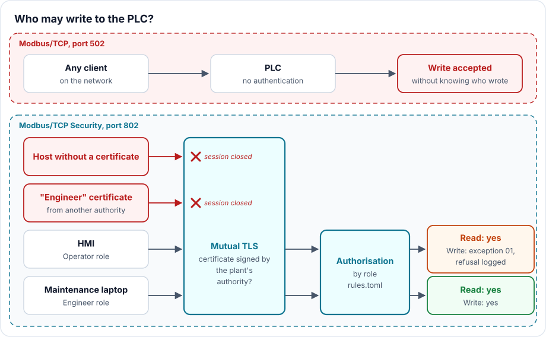

# Modbus never asks "who is there?": mutual TLS and roles

> **CRA & Dev #7** · ["CRA & Dev" series](index.md) · Reading time: about 6 min · Industrial, Modbus ·
> Example: Python (pymodbus)

## What the CRA requires

The [Cyber Resilience Act][cra] requires a product to protect itself from
unauthorised access, through authentication or identity and access management, and
to report on possible unauthorised access (Annex I, Part I, point 2, d). Add a secure
by default configuration (point b) and limited attack surfaces, external interfaces
included (point j).

For a PLC, a drive or a motion controller, the question is therefore: when a Modbus
command arrives, does the product know who sent it?

## The classic trap

Modbus/TCP has no password and no notion of a user: any client that reaches port 502
reads and writes whatever the device exposes. This is not a bug, it is the protocol,
and serial-to-Ethernet Modbus gateways inherit it.

The FrostyGoop malware, analysed by [Dragos][dragos], uses exactly that: over Modbus
TCP on port 502, it left the customers of a Ukrainian district heating company
without heating for two days. Security advisories follow the same pattern, such as
[CVE-2025-48466][cve-advantech], where an unauthenticated attacker drives the outputs
of an I/O module. And "our network is isolated" does not hold: a compromised
maintenance laptop or remote access router reaches port 502 from the inside.

## The technique: Modbus/TCP Security

Modbus.org has specified [Modbus/TCP Security][mbsec] ("mbaps"), on port 802,
[registered with IANA][iana]. Modbus frames do not change, they travel inside a
TLS 1.2 or newer session (R-01). The client presents an X.509 certificate too, or
the device closes the session (R-02, R-10). The certificate carries a role, in the
extension `1.3.6.1.4.1.50316.802.1` (R-21), and each request is authorised or not
according to that role; a refusal returns Modbus exception 01, *Illegal function*
(R-31).



On the device side, in Python with [pymodbus][pymodbus] (simplified excerpt from
`mbsec/plc.py`):

```python
ctx = ssl.SSLContext(ssl.PROTOCOL_TLS_SERVER)
ctx.minimum_version = ssl.TLSVersion.TLSv1_2   # R-01
ctx.verify_mode = ssl.CERT_REQUIRED            # R-02: client certificate required
ctx.load_verify_locations("ca.crt")            # signed by the plant's authority

def callback_connected(self):                  # once per session
    der = self.transport.get_extra_info("ssl_object").getpeercert(binary_form=True)
    self.role = role_from_certificate(der)

async def handle_request(self):                # on every request
    if not self.server.rules.authorise(self.role, self.last_pdu.function_code):
        log.warning("DENIED ...")              # report (CRA, point d)
        return self.reply_exception(ExcCodes.ILLEGAL_FUNCTION)   # R-31
    await super().handle_request()
```

The rules, for example "`Operator` reads, `Engineer` reads and writes", live in a
`rules.toml` file the operator can edit, as the specification requires (R-27).

The [demo][example] runs two simulated PLCs driving the spindle of a machine tool.
The first case replays what FrostyGoop did: any client rewrites the setpoint.
Excerpt from `uv run python -m mbsec.demo`:

```
1. Legacy PLC, plain Modbus/TCP: anyone on the network sets the spindle to 60000 rpm
   write: accepted
3. Client with an Engineer role, signed by its own CA
   write: rejected, the PLC closed the TLS session
4. Operator (HMI): may read, may not write
   read:  12000 rpm
   write: refused, Modbus exception 1 (Illegal function)
6. Engineer (maintenance laptop): may write
   write: accepted
```

Case 3 matters: anyone can mint an `Engineer` certificate. Only the signature of the
plant's authority gives it value.

## When the device cannot do TLS

The CRA does not impose a protocol. Without Modbus/TCP Security, at least ship the
Modbus/TCP service disabled by default (point b), limited to what is needed
(read-only, a dedicated interface, an address allowlist, point j), and document that
it must stay in an isolated network zone. An IP address allowlist reduces exposure
but authenticates no one: on the same network, an address can be spoofed.

## Three things to know

1. The real work is the key infrastructure: an authority per plant, certificates
   that expire and can be withdrawn, the authority's key offline or in an HSM, like
   the signing key of [episode 6](CRA-Dev-06-FUOTA-LoRaWAN.md).
2. The specification provides for a suite without encryption,
   `TLS_RSA_WITH_NULL_SHA256` (R-67): authenticated, but in the clear. Enabling it
   means giving up confidentiality (point e).
3. TLS does not protect against a compromised legitimate client: a hacked
   maintenance laptop keeps its `Engineer` role. Narrow roles limit the damage, and
   the log of refusals helps spot a client going beyond its role. Refused TLS
   sessions never reach Modbus: log them in the TLS layer.

## Takeaway

Modbus/TCP executes what it is sent without asking who sent it. Modbus/TCP Security
asks the question: a certificate signed by the plant to get in, a role to decide on
each request, a logged refusal. Failing that, the service must be off by default,
restricted and isolated.

---

*Previous episode: [A thousand fragments, one signature, updating firmware over
LoRaWAN](CRA-Dev-06-FUOTA-LoRaWAN.md).*

*Next episode: [A log that cannot lie, chain and sign your
logs](CRA-Dev-08-Signed-Logs.md).*

*Companion code, in [`examples/07-modbus-tls`][example]: the two simulated PLCs, the
demo and its tests.*

[cra]: https://eur-lex.europa.eu/eli/reg/2024/2847/oj?locale=en
[mbsec]: https://www.modbus.org/file/secure/modbussecurityprotocol.pdf
[iana]: https://www.iana.org/assignments/service-names-port-numbers/service-names-port-numbers.xhtml?search=mbap-s
[dragos]: https://www.dragos.com/blog/protect-against-frostygoop-ics-malware-targeting-operational-technology/
[cve-advantech]: https://www.cve.org/CVERecord?id=CVE-2025-48466
[pymodbus]: https://pymodbus.readthedocs.io/
[example]: https://github.com/ADNTIO/cra-dev-wiki/tree/main/examples/07-modbus-tls
