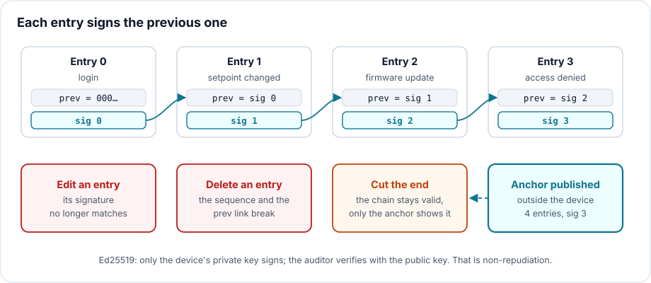

# A log that cannot lie: chain and sign your logs

> **CRA & Dev #8** · ["CRA & Dev" series](index.md) · Reading time: about 6 min · Cross-platform ·
> Example: Python (cryptography)

## What the CRA requires

The [Cyber Resilience Act][cra] requires a product to provide security related
information by recording and monitoring relevant internal activity, including the
access to or modification of data, services or functions, with an opt-out mechanism
for the user (Annex I, Part I, point 2, l).

For a developer: who logged in, who changed a setpoint, who updated the firmware,
who was refused access, like the log of refusals in
[episode 7](CRA-Dev-07-Modbus-TLS.md). And that log must stay trustworthy on the day
you need it, that is, after an intrusion.

## The classic trap

A plain-text log, even timestamped, can be rewritten. An attacker who has taken over
the device erases or edits the lines that give them away. It is a catalogued
technique in [MITRE ATT&CK][mitre]: clearing Windows event logs with `wevtutil cl`.
NotPetya did it at scale in 2017: according to [Talos's analysis][talos], the
malware ran
`wevtutil cl Setup & wevtutil cl System & wevtutil cl Security & wevtutil cl Application`
on every compromised machine.

Second trap: adding a hash to each line. The attacker edits the line and recomputes
the hash, exactly as with the file in [episode 4](CRA-Dev-04-Integrite.md). A hash
detects corruption, not forgery.

## The technique: chain and sign

Each entry carries the signature of the previous entry, then is signed itself:

```
entry n = { seq: n, time, event, prev: signature of entry n-1, sig }
```

Editing an entry invalidates its signature. Deleting or inserting an entry breaks
the sequence number or the `prev` link. Rewriting the past unnoticed would take the
signing key.



In Python, with Ed25519 from the [cryptography][cryptography] library (simplified
excerpt from `chainlog/log.py`):

```python
def append(self, **event):
    record = {"seq": self.count, "time": now(), "event": event, "prev": self.last}
    record["sig"] = self.signer.sign(signed_part(record)).hex()
    self.path.open("a").write(json.dumps(record) + "\n")
    self.count, self.last = self.count + 1, record["sig"]
```

One blind spot remains: cutting the end of the log. The remaining chain is valid. The
remedy is an anchor, the entry count and the last signature, published regularly
outside the device, to a log server for example. The [demo][example] shows it:

```
2. Attacker edits entry 1 (hides who changed the spindle speed)
   verify: TAMPERING DETECTED, entry 1: bad signature (entry modified)
3. Attacker deletes entry 2 (hides the firmware update)
   verify: TAMPERING DETECTED, entry 2: sequence jumps to 3 (entry removed or inserted)
4. Attacker cuts the last 2 entries
   chain alone: OK
   with anchor: TAMPERING DETECTED, log ends at 3 entries, the anchor says 5 (end truncated)
```

## Non-repudiation, or why a signature and not an HMAC

Three levels of proof:

- a hash chain detects a modification, but anyone can compute a new one: it says
  nothing about the author;
- a chained HMAC proves the log comes from a holder of the key. But the verifier
  holds the same key, and can therefore forge a valid entry. The device can always
  deny;
- an Ed25519 signature can only come from the holder of the private key, which stays
  on the device. The auditor verifies with the public key only. The device cannot
  deny having written the entry: that is non-repudiation.

The demo makes it visible: a fake entry signed with the shared HMAC key passes
verification, while an auditor holding only the public key cannot sign anything.

## Three things to know

1. On Linux, the tool already exists. `journalctl --setup-keys` enables
   systemd-journald's [Forward Secure Sealing][journalctl]: a sealing key stays on
   the machine, the verification key is kept elsewhere, and `journalctl --verify`
   checks authenticity. The sealing key changes at a regular interval, 15 minutes by
   default: the shorter the interval, the shorter the window in which an alteration
   goes unnoticed ([`Seal=`][journald-conf]). For logs sent over syslog,
   [RFC 5848][rfc5848] defines signed messages, with a counter that reveals missing
   messages.
2. Everything rests on the key. On the device, it belongs in a secure element or a
   TPM, at the very least in a file only the logging service can read. A key that
   never changes lets whoever steals it rewrite the whole history; a key that evolves
   limits the damage to the current period.
3. The opt-out the CRA requires must not become a hole. The text does not say how to
   offer it; we recommend writing the opt-out itself, with its author, as the last
   signed entry of the chain. You then know when and by whom monitoring was turned
   off, and that it was not an attacker doing it silently.

## Takeaway

A log is only worth something if it withstands the person it should expose. Chaining
each entry to the signature of the previous one makes any modification, deletion or
insertion visible; an anchor published elsewhere reveals truncation; an asymmetric
signature adds non-repudiation, which an HMAC cannot give. That is what turns the
logging the CRA requires into evidence.

---

*Previous episode: [Modbus never asks "who is there?", mutual TLS and
roles](CRA-Dev-07-Modbus-TLS.md).*

*Companion code, in [`examples/08-secure-logging`][example]: the chained, signed log,
the demo and its tests.*

[cra]: https://eur-lex.europa.eu/eli/reg/2024/2847/oj?locale=en
[mitre]: https://attack.mitre.org/techniques/T1685/005/
[talos]: https://blog.talosintelligence.com/worldwide-ransomware-variant/
[cryptography]: https://cryptography.io/en/latest/hazmat/primitives/asymmetric/ed25519/
[journalctl]: https://www.freedesktop.org/software/systemd/man/latest/journalctl.html
[journald-conf]: https://www.freedesktop.org/software/systemd/man/latest/journald.conf.html
[rfc5848]: https://www.rfc-editor.org/rfc/rfc5848
[example]: https://github.com/ADNTIO/cra-dev-wiki/tree/main/examples/08-secure-logging
