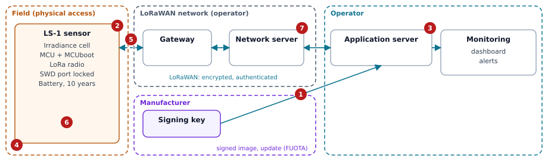

# Risk assessment: LS-1 sunlight sensor, version 1.0

> Fictional example, written for the "CRA & Dev" series to illustrate Article 13 of
> the Cyber Resilience Act. The product, the choices and the ratings are examples:
> they do not replace the analysis of your own product.

PDF version: [evaluation-risques-capteur-ensoleillement.pdf](evaluation-risques-capteur-ensoleillement.pdf). Source: `examples/risk-assessment/en/sunlight-sensor.md`.

## 1. Context

| Item | Content |
| --- | --- |
| Intended purpose | Measure solar irradiance (W/m²) on a photovoltaic or agricultural site, and send it every 15 minutes over LoRaWAN to the operator's platform, which estimates the expected production. |
| Reasonably foreseeable use | A local authority's weather station, with data published as open data; a reference to detect a drop in panel output and trigger a maintenance visit. |
| Conditions of use | Outdoors, on a pole, on fenced or open sites. Battery powered. Public or private LoRaWAN network. |
| Assets to protect | Firmware integrity; LoRaWAN keys (a root key unique to each device); integrity and availability of the readings; battery life. |
| Data processed | Irradiance, internal temperature, battery voltage. No personal data. |
| Expected time in use | 10 years. Support period: 10 years. |
| Interfaces | LoRaWAN radio (readings, configuration, updates); SWD debug port, locked in production. No local user interface. |

## 2. Diagram

The numbers refer to the risks in the next table.

## 3. Risks

Likelihood (L) and impact (I): low, medium, high.

| # | Threat: who, through what | L | I | Decision | Measure or justification |
| --- | --- | --- | --- | --- | --- |
| 1 | Malicious firmware is pushed through the radio update | low | high | reduce | Image signed by the manufacturer, verified by MCUboot before installation; rollback to an older version forbidden (point 2 (c), (f)). |
| 2 | The root key is extracted from a sensor stolen from its pole | medium | low | reduce | One key per device: a theft compromises one sensor only. SWD port locked (point 2 (d), (j)). |
| 3 | An abusive configuration is sent (a 10 s interval that drains the battery) | low | medium | reduce | Configuration accepted only if authenticated by the LoRaWAN session; values bounded between 5 min and 24 h (point 2 (h)). |
| 4 | The cell is covered or turned away on site | medium | low | accept | Out of the device's reach. The platform compares readings with neighbouring sensors and with the theoretical irradiance. |
| 5 | The radio is jammed, readings are lost | low | low | accept | Lost readings have no safety consequence; the platform flags a silent sensor. |
| 6 | A known vulnerability affects a dependency (RTOS, LoRaWAN stack) | high | medium | reduce | SBOM for each release, continuous monitoring, fix delivered by radio update (Part II, points 1 and 2). |
| 7 | After an outage, the whole fleet tries to rejoin the network at once | medium | medium | reduce | Retries spaced out, with a growing delay and some randomness (point 2 (i)). |

## 4. Annex I, Part I, point 2

| Point | Applicable? | Implementation, or justification |
| --- | --- | --- |
| (a) No known exploitable vulnerability | Yes | SBOM analysed before each release; no known exploitable vulnerability is shipped. |
| (b) Secure by default, reset to original state | Yes | No shared default secret; a cautious measurement interval (15 min). An internal button restores the factory configuration. |
| (c) Security updates | Yes | Signed radio updates, installed automatically by default; the operator can postpone them. |
| (d) Protection from unauthorised access | Yes | No local interface; SWD locked; only commands authenticated by the LoRaWAN session are accepted. |
| (e) Confidentiality | Yes, low stakes | Payload encrypted by LoRaWAN; no personal data. |
| (f) Integrity | Yes | Authenticated frames and frame counters; signed firmware; bounded configuration. |
| (g) Data minimisation | Yes | Only the three useful quantities are sent. |
| (h) Availability of essential functions | Yes | Watchdog; measuring does not depend on receiving commands; bounded configuration. |
| (i) No impact on other networks | Yes | Radio duty cycle respected; connection retries spaced out. |
| (j) Limited attack surface | Yes | A single external interface, the radio; SWD locked. |
| (k) Exploitation mitigation | Yes | Compiler and RTOS hardening (stack canaries, MPU memory protection). |
| (l) Logging and monitoring | Yes, in a reduced form | Restarts, failed joins and update results counted and sent in a daily status message, which can be turned off by configuration. |
| (m) Removal of data and settings | Yes | Factory reset erases the session, the configuration and pending readings. The root key is kept: it is the device's identity, not user data. |

## 5. Annex I, Part I, point 1, and Part II

- **Target cybersecurity level: moderate.** The sensor processes no personal data and controls nothing; a wrong or lost reading only has an operational impact.
- **Vulnerability handling:** a CycloneDX SBOM for each release, continuous monitoring of dependencies, a published contact address with a disclosure policy, fixes delivered by radio update, published security advisories.

## 6. History

| Date | Version | Change |
| --- | --- | --- |
| 2026-10-06 | 1.0 | First assessment. |
