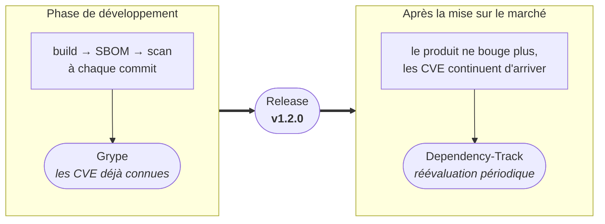
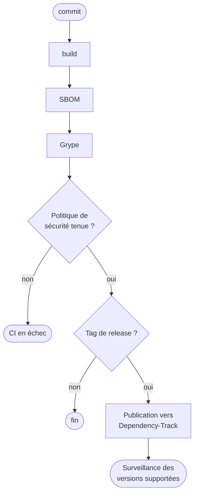

# Générer un SBOM ne suffit pas : surveillez-le avec Dependency-Track

> **CRA & Dev #5** · [Série « CRA & Dev »](index.md) · Lecture : environ 5 min · CI/CD, multiplateforme ·
> Outils : Grype, Dependency-Track

L'[épisode 1](CRA-Dev-01-SBOM-VEX.md) produit un SBOM CycloneDX à chaque build. Reste
la question qui compte vraiment :

> une vulnérabilité publiée aujourd'hui touche-t-elle une version de notre produit
> encore supportée ?

Y répondre demande de contrôler à deux moments distincts : pendant le développement,
pour les vulnérabilités déjà connues au moment du build, et après la mise sur le
marché, pour celles découvertes plus tard dans des composants déjà livrés.



Le CRA impose de traiter les vulnérabilités pendant toute la période de support, mais
il n'impose ni outil ni seuil de sévérité. Tout ce qui suit relève du choix
d'implémentation.

## Le piège classique

Le pipeline génère un SBOM, l'archive, et ne le rouvre jamais :

```text
build → SBOM → archive → oubli
```

Cet inventaire est daté, ce n'est pas un processus. Une CVE publiée trois mois plus
tard ne déclenche aucune analyse, et personne ne sait quelles versions sont
concernées.

L'autre erreur consiste à écraser toujours le même projet `latest`. On perd alors le
lien entre une version livrée, son artefact et sa composition exacte.

## La technique : contrôler maintenant, surveiller ensuite



Chaque commit est contrôlé, mais seules les versions réellement livrées entrent
durablement dans le portfolio. Cela évite de le remplir de branches et de builds
temporaires.

### 1. Fixer le seuil d'échec de Grype

Grype consomme directement le SBOM CycloneDX produit au build, sans conversion :

```bash
grype sbom:bom.json --fail-on high
```

Ce seuil n'est pas une exigence du CRA. Il s'adapte à l'exposition du produit, à
l'existence d'un correctif et au délai de remédiation que vous vous fixez. La syntaxe
de `--fail-on` est décrite dans la [référence Grype][grype].

Un scan ne vaut que par la qualité du SBOM qui l'alimente. Vérifiez au minimum que
chaque composant porte un nom, une version et un identifiant Package URL (`purl`) :
sans `purl`, la corrélation avec les bases de vulnérabilités devient approximative.

### 2. Publier vers Dependency-Track

L'API accepte le nom et la version du projet, et peut le créer au premier envoi. Dans
GitHub Actions, le nom du dépôt et le tag suffisent comme identifiants :

```yaml
env:
  PROJECT_NAME: ${{ github.event.repository.name }}
  PROJECT_VERSION: ${{ github.ref_name }}
```

L'envoi se fait alors en une seule requête :

```bash
curl --fail-with-body --request POST "$DTRACK_URL/api/v1/bom" \
  --header "X-Api-Key: $DTRACK_API_KEY" \
  --form "autoCreate=true" \
  --form "projectName=$PROJECT_NAME" \
  --form "projectVersion=$PROJECT_VERSION" \
  --form "bom=@bom.json"
```

L'option `--fail-with-body` fait échouer le job sur une réponse HTTP en erreur tout
en conservant le message du serveur. Les paramètres d'import sont décrits dans la
[documentation CI/CD de Dependency-Track][dtrack-ci].

C'est ici que se joue la surveillance après mise sur le marché :
[Dependency-Track][dtrack] réévalue périodiquement les composants de son portfolio.
Une version publiée peut donc produire une nouvelle alerte sans être reconstruite. La
fréquence dépend de votre instance, voir ses [tâches récurrentes][dtrack-tasks].

### 3. Protéger la clé API

La clé est un secret, et doit vivre dans le gestionnaire de secrets de la CI :

```yaml
env:
  DTRACK_API_KEY: ${{ secrets.DTRACK_API_KEY }}
  DTRACK_URL: ${{ vars.DTRACK_URL }}
```

Utilisez une équipe et une clé dédiées à la CI, au moindre privilège. L'import
demande `BOM_UPLOAD` ; avec `autoCreate=true`, il demande aussi
`PROJECT_CREATION_UPLOAD`, comme l'indique la [liste des permissions][dtrack-perms].

## Un résultat de scanner n'est pas une preuve d'exploitabilité

Grype rapproche des composants et des avis de sécurité. Cette correspondance ne
prouve pas que la faille est atteignable dans votre produit : le code concerné peut
être inaccessible, la fonctionnalité désactivée, une mesure compensatoire en place.
Le résultat alimente donc un triage, dont la conclusion se documente en VEX, comme vu
dans l'[épisode 1](CRA-Dev-01-SBOM-VEX.md).

## Trois choses à savoir

1. Un SBOM n'est pas un scanner. Il décrit la composition du produit ; un autre outil
   rapproche cette composition des vulnérabilités connues.
2. Un scan ne vaut que ses données du moment. La base de vulnérabilités doit être à
   jour, et les versions déjà livrées doivent rester surveillées.
3. La sévérité ne suffit pas à décider. L'exposition, la disponibilité d'un correctif
   et votre politique de risque comptent autant que le score.

## À retenir

Un SBOM archivé est une pièce de conformité, un SBOM publié et réévalué est un outil
d'exploitation. Contrôlez chaque build avec une politique explicite, et gardez sous
surveillance les versions encore déployées. Cette chaîne améliore la visibilité, elle ne rend pas un produit sûr : elle
ne voit ni les failles du code propriétaire, ni les erreurs de configuration, ni les
secrets exposés. Et une alerte sans responsable ni délai de triage reste du bruit.

---

*Épisode précédent : [Faites confiance, mais vérifiez](CRA-Dev-04-Integrite.md).*

[grype]: https://oss.anchore.com/docs/reference/grype/configuration/
[dtrack]: https://dependencytrack.org/
[dtrack-ci]: https://docs.dependencytrack.org/usage/cicd/
[dtrack-tasks]: https://docs.dependencytrack.org/getting-started/recurring-tasks/
[dtrack-perms]: https://docs.dependencytrack.org/administration/users-and-permissions/
