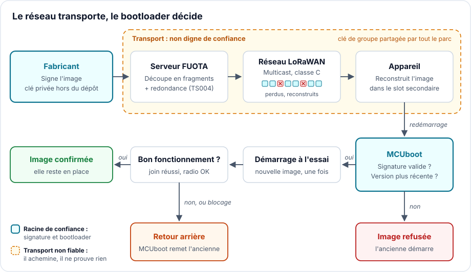
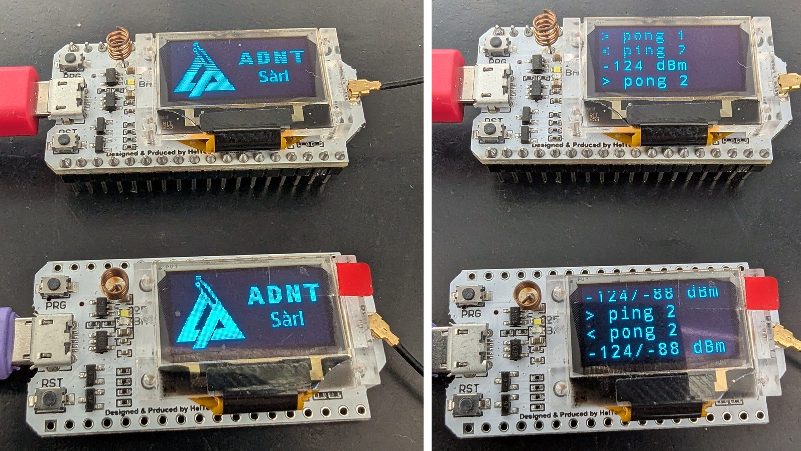

# Mille fragments, une seule signature : mettre à jour un firmware par LoRaWAN

> **CRA & Dev #6** · [Série « CRA & Dev »](index.md) · Lecture : environ 9 min · Embarqué (ESP32), LoRaWAN ·
> Outils : Zephyr, MCUboot, imgtool

## Ce que demande le CRA

Un produit doit pouvoir être corrigé après sa mise sur le marché. Le [Cyber Resilience
Act][cra] demande que les vulnérabilités puissent être traitées par des mises à jour
de sécurité, automatiques lorsque c'est applicable (Annexe I, partie I, point 2, c),
et que le fabricant dispose de mécanismes pour distribuer ces mises à jour de manière
sécurisée (partie II, point 7), sans retard (point 8).

Sur un serveur, c'est un téléchargement HTTPS. Sur un capteur LoRaWAN posé en haut
d'un mât pour dix ans, alimenté par une pile, c'est un autre métier. Le réseau
transporte quelques dizaines d'octets par trame, l'appareil n'écoute presque jamais,
et personne n'ira le reflasher à la main. La réponse s'appelle FUOTA (*Firmware
Update Over The Air*), et elle ne dispense pas de signer ce qu'on envoie.

## Le piège classique

Trois erreurs, toutes fréquentes.

Croire que le chiffrement LoRaWAN authentifie le firmware. Pour mettre à jour un parc,
on diffuse les fragments en multicast, chiffrés avec une clé de groupe. Cette clé est
par construction identique dans tous les appareils du groupe. Si un attaquant extrait
les clés de session multicast d'un seul appareil, il peut fabriquer des fragments que
tous les autres accepteront. La [spécification de fragmentation][ts004] le dit
elle-même (section 4) : sauf élément sécurisé dans tous les appareils du groupe, ces
clés ne peuvent pas être considérées comme sûres, une étape supplémentaire d'intégrité
et d'authentification du fichier est nécessaire, et pour un firmware la solution
recommandée est une signature à clé publique. C'est exactement le critère de
l'[épisode 4](CRA-Dev-04-Integrite.md) : quand celui qui vérifie ne doit pas pouvoir
forger, un secret partagé ne suffit plus.

Envoyer l'image complète sans compter. Une [étude de l'University College
Cork][fuota-paper] fait le calcul pour une image de 50 ko à DR2 (SF10), soit
51 octets utiles par trame : environ 1 004 downlinks, et autour de 17 heures pour un
seul appareil à cause de la limite de 1 % de temps d'émission en Europe. Sans
multicast, un parc entier se compte en semaines.

Ne pas prévoir l'échec. Une image incomplète, ou complète mais qui ne démarre pas,
et le capteur est perdu. Sans retour arrière automatique, chaque mise à jour est un
pari.

## La technique : séparer le transport de la confiance

Le principe tient en une phrase : le réseau transporte, le bootloader décide. On
laisse LoRaWAN acheminer des octets, et on ne démarre que ce qui porte une signature
valide.



### 1. Le transport : trois briques standard

La LoRa Alliance a découpé la FUOTA en paquets applicatifs indépendants, chacun sur
son port.

| Brique | Spécification | Port | Rôle |
| --- | --- | --- | --- |
| Synchronisation d'horloge | [TS003][ts003] | 202 | Mettre les appareils à l'heure, pour qu'ils ouvrent leur fenêtre d'écoute au même moment |
| Configuration du multicast | [TS005][ts005] | 200 | Remettre à chaque appareil la clé du groupe et l'heure de la session (classe B ou C) |
| Transport fragmenté | [TS004][ts004] | 201 | Découper l'image en fragments, avec des fragments redondants |

Une session se déroule ainsi (figure 3 de l'[étude citée][fuota-paper]). Le serveur
configure chaque appareil en unicast (groupe multicast, session de fragmentation,
heure de début). À l'heure dite, tous passent en classe C et écoutent en continu. Le
serveur diffuse les fragments une seule fois pour tout le groupe. Les appareils
reconstruisent l'image, puis reviennent en classe A.

La redondance évite les retransmissions. Les fragments supplémentaires sont des
combinaisons des fragments d'origine : selon la spécification, 10 % de redondance
permettent de perdre environ 10 % des trames et de reconstruire quand même le
fichier, sans rien redemander au serveur.

### 2. La confiance : signer l'image, vérifier au démarrage

Avec [MCUboot][mcuboot-design], la signature fait partie de l'image. Le bootloader
contient la clé publique et refuse de démarrer une image dont la signature ne
correspond pas, quel que soit le chemin par lequel elle est arrivée.

On génère la paire de clés une fois, avec [`imgtool`][imgtool].

```bash
# Paire de clés ECDSA P-256 (ed25519 et RSA sont aussi pris en charge)
imgtool keygen -k fuota-ecdsa-p256.pem -t ecdsa-p256
```

Puis on règle le bootloader dans `sysbuild.conf`, et on passe la clé à la
compilation, pour que son chemin reste hors du dépôt. Le build signe l'application
et embarque la clé publique dans MCUboot. Les commandes sont celles du
[firmware d'exemple][example], ici pour une carte Heltec WiFi LoRa 32 (ESP32 et
radio SX1276).

```ini
# sysbuild.conf
SB_CONFIG_BOOTLOADER_MCUBOOT=y
SB_CONFIG_BOOT_SIGNATURE_TYPE_ECDSA_P256=y
SB_CONFIG_MCUBOOT_MODE_SWAP_SCRATCH=y   # échange des slots : retour arrière possible
```

```bash
west build -b heltec_wifi_lora32_v2/esp32/procpu --sysbuild firmware -- \
  -DSB_CONFIG_BOOT_SIGNATURE_KEY_FILE='"/chemin/hors-depot/fuota-ecdsa-p256.pem"'
# Image à confier au serveur FUOTA : build/firmware/zephyr/zephyr.signed.bin
```

C'est ce fichier signé que le serveur fragmente. La signature voyage dans les
fragments, comme le reste.

### 3. Côté appareil : recevoir, redémarrer, confirmer

Le firmware d'exemple s'appuie sur les mêmes services que l'[exemple FUOTA de
Zephyr][zephyr-fuota]. Quelques options activent les trois briques.

```ini
# prj.conf (extrait)
CONFIG_LORAWAN_SERVICES=y
CONFIG_LORAWAN_APP_CLOCK_SYNC=y      # TS003
CONFIG_LORAWAN_REMOTE_MULTICAST=y    # TS005
CONFIG_LORAWAN_FRAG_TRANSPORT=y      # TS004
CONFIG_IMG_MANAGER=y                 # écriture dans le slot secondaire
CONFIG_REBOOT=y
```

Le code applicatif lance les services, réagit quand l'image est complète, et décide
si une nouvelle image mérite d'être gardée (extrait simplifié de `firmware/src/main.c`).

```c
/* Appelé quand l'image est reconstruite dans le slot secondaire.
 * Zephyr a déjà demandé à MCUboot un démarrage « à l'essai ». */
static void fuota_finished(void)
{
	k_sem_give(&image_received); /* la boucle principale redémarrera */
}

int main(void)
{
	bool confirmed = boot_is_img_confirmed();

	/* ... lorawan_start() ... */
	bool joined = join() == 0;
	bool services = joined && start_services(); /* TS003, TS004 ; TS005 démarre seul */

	/* Le test de bon fonctionnement. Une image à l'essai qui le rate
	 * redémarre sans se confirmer : MCUboot remet l'ancienne. */
	if (!confirmed) {
		if (!services) {
			sys_reboot(SYS_REBOOT_COLD);
		}
		boot_write_img_confirmed();
	}

	/* ... boucle principale : uplinks réguliers (en classe A, ce sont eux qui
	 * ouvrent les fenêtres de réception dont le serveur a besoin), nouvelles
	 * tentatives de join si le réseau manque, et redémarrage dès que
	 * image_received est donné ... */
}
```

Au redémarrage, MCUboot [vérifie la signature][mcuboot-design] de l'image reçue avant
de l'échanger avec l'ancienne. Une image forgée, tronquée ou mal reconstruite ne
démarre jamais.

### 4. Confirmer, ou revenir en arrière

Zephyr [demande la mise à jour en mode test][zephyr-frag-flash] (`BOOT_UPGRADE_TEST`).
La nouvelle image démarre une fois. Si elle n'appelle pas
`boot_write_img_confirmed()`, MCUboot [remet l'ancienne][mcuboot-design] au reset
suivant. D'où l'intérêt de confirmer tard, après un vrai test de bon fonctionnement,
ici le join réussi et les services FUOTA démarrés, et de laisser un watchdog provoquer
le reset si le firmware se bloque avant. Cela suffit pour la démonstration, pas pour
un produit : confirmez l'image au terme d'une politique explicite (chien de garde
nourri, migration de la configuration et du stockage réussie, périphériques critiques
initialisés, voire un premier échange applicatif avec le backend).

Reste le retour arrière malveillant : rejouer une ancienne image, correctement signée,
mais vulnérable. MCUboot [décrit deux protections][mcuboot-design]. La première
compare les numéros de version (`CONFIG_MCUBOOT_DOWNGRADE_PREVENTION`). Sa
documentation la réserve à la stratégie par écrasement. La seconde s'appuie sur un
compteur de sécurité stocké dans le matériel
(`CONFIG_MCUBOOT_HW_DOWNGRADE_PREVENTION`) et refuse toute image dont le compteur est
inférieur. Une valeur égale passe : il faut donc incrémenter le compteur à chaque
correctif de sécurité.

!!! warning "Observation de banc, pas une garantie"
    Avec le MCUboot livré par Zephyr 4.4.2, nous avons vu la protection par numéro de
    version refuser une ancienne image aussi en mode échange de slots. C'est un
    comportement observé, pas une propriété de sécurité documentée : ne vous appuyez
    pas dessus, et vérifiez sur votre version.

Le [banc d'essai][example] de l'exemple dépose dans le slot secondaire d'une vraie
carte une image forgée, une image altérée d'un bit, une ancienne version et une mise
à jour incapable de rejoindre le réseau. La console du bootloader et du firmware
répond, dans l'ordre :

```
E: Image in the secondary slot is not valid!
I: Image 0 in slot 1 erased due to downgrade prevention
<wrn> fuota: Rebooting: test image unable to join the network
I: Image index: 0, Swap type: revert
```

Une deuxième carte peut aussi jouer l'émetteur, en LoRa point à point : sur notre
banc, l'image de 200 ko est passée en 33 minutes, 7 fragments perdus en route ont été
reconstruits, puis MCUboot a vérifié la signature et démarré la nouvelle version.



*Le banc : deux cartes Heltec (ESP32, SX1276). À droite, le test radio dans les deux
sens : −124 dBm à l'aller, −88 dBm au retour.*

## Trois choses à savoir

1. Comptez votre temps d'antenne avant d'écrire du code. La taille de l'image fixe la
   durée et la consommation. Dans l'étude citée, une mise à jour à DR0 (SF12) prend
   près de 30 fois plus longtemps qu'à DR5 (SF7), mais DR5 n'atteint que 45 % des
   appareils du déploiement simulé. Les leviers sont connus : une image petite, une
   mise à jour différentielle plutôt que complète ([recommandation de The Things
   Stack][tti-fuota]), une taille de fragment calée sur le débit le plus bas du
   groupe. Avec un delta, la signature doit porter sur l'image reconstruite, pas sur
   le patch. Comptez aussi la RAM : le décodeur de Zephyr réserve sa mémoire [selon la
   taille d'image, la taille de fragment et la redondance][zephyr-frag-kconfig]. Avec
   les valeurs par défaut, il réclamait plus de 5 Mo sur notre ESP32, qui en offre 192
   Ko.
2. Remplacez la clé par défaut. Sans `SB_CONFIG_BOOT_SIGNATURE_KEY_FILE`, le build
   utilise la clé d'exemple livrée dans le dépôt public de MCUboot, dont la
   [documentation][mcuboot-zephyr] rappelle que la clé privée est accessible à tous.
   Et comme pour Authenticode ([épisode 2](CRA-Dev-02-Authenticode.md)), la vôtre ne
   vit ni dans le dépôt ni en clair dans la CI : pour un produit, elle reste hors
   ligne ou dans un HSM, et seule la clé publique sert à compiler le bootloader
   ([modèle de garde][mcuboot-zephyr] de MCUboot). Sa fuite est le pire scénario de
   cette architecture : quiconque la détient signe des images que tout le parc
   démarrera. Le port Zephyr accepte plusieurs clés de vérification, ce qui permet de
   basculer sur une clé de secours ; mais tant que l'ancienne reste dans le
   bootloader, une image signée avec elle passe encore. Prévoyez donc avant la mise en
   production comment vous la retirerez. Vérifiez aussi les réglages par défaut de
   votre carte : pour la Heltec de l'exemple, Zephyr [désactive la
   signature][heltec-sysbuild], et MCUboot sur ESP32 [ne vérifie pas le slot primaire
   et écrase sans retour arrière][mcuboot-esp32].
3. La signature ne protège pas tout. Un appareil compromis du groupe peut toujours
   lire le firmware diffusé et injecter des fragments pour faire échouer la session,
   puisqu'il détient les clés du groupe ([TS004][ts004], section 4). Il ne peut pas
   faire démarrer son propre code. Si le firmware est confidentiel, MCUboot sait aussi
   gérer des [images chiffrées][mcuboot-enc]. Et le code qui reçoit les fragments est
   lui-même une surface d'attaque : la [CVE-2026-13480][cve] est une lecture hors
   limites dans le décodeur TS004 de Zephyr, corrigée en 4.4.2. Suivre les
   vulnérabilités de sa pile radio relève de l'[épisode 1](CRA-Dev-01-SBOM-VEX.md).

## À retenir

Sur LoRaWAN, la mise à jour est une affaire de budget radio et de confiance. Les
spécifications FUOTA fournissent les briques du premier : horloge, multicast,
fragments redondants ; le débit, la taille d'image, la couverture et la RAM restent
des choix d'ingénierie. Elles laissent le second au fabricant. Signez l'image, faites-la
vérifier par le bootloader, confirmez-la seulement quand elle a fait ses preuves, et
interdisez le retour à une version vulnérable. C'est ce qui transforme un canal de
quelques octets en mécanisme de mise à jour sécurisé au sens du CRA.

---

*Épisode précédent : [Générer un SBOM ne suffit pas, surveillez-le avec
Dependency-Track](CRA-Dev-05-SBOM-DTRACK.md).*

*Épisode suivant : [Qui a fait quoi, et quand ? Journaliser l'activité de
sécurité](CRA-Dev-07-Security-Logs.md).*

*Code d'accompagnement, dans [`examples/06-fuota-lorawan`][example] : une session
FUOTA simulée de bout en bout avec ses tests, et le firmware Zephyr complet, avec
son banc d'essai sur carte Heltec ESP32. Le README de l'exemple est en anglais.*

*Pour aller plus loin : l'[architecture de mise à jour de firmware pour l'IoT][rfc9019]
de l'IETF (RFC 9019), la [version 2.0.0 de TS004][ts004-v2] publiée en 2022 (l'exemple
Zephyr et [AWS IoT Core for LoRaWAN][aws-fuota] implémentent la 1.0.0).*

[ts003]: https://resources.lora-alliance.org/technical-specifications/ts003-2-0-0-application-layer-clock-synchronization
[ts004]: https://resources.lora-alliance.org/technical-specifications/lorawan-fragmented-data-block-transport-specification-v1-0-0
[ts004-v2]: https://resources.lora-alliance.org/technical-specifications/ts004-2-0-0-fragmented-data-block-transport
[ts005]: https://resources.lora-alliance.org/technical-specifications/lorawan-remote-multicast-setup-specification-v1-0-0
[fuota-paper]: https://arxiv.org/abs/2002.08735
[zephyr-fuota]: https://docs.zephyrproject.org/latest/samples/subsys/lorawan/fuota/README.html
[mcuboot-design]: https://docs.mcuboot.com/design.html
[imgtool]: https://docs.mcuboot.com/imgtool.html
[tti-fuota]: https://www.thethingsindustries.com/docs/concepts/features/lorawan/fuota/
[aws-fuota]: https://docs.aws.amazon.com/iot-wireless/latest/developerguide/lorawan-mc-fuota-overview.html
[cve]: https://github.com/zephyrproject-rtos/zephyr/security/advisories/GHSA-845m-2m84-g5h2
[rfc9019]: https://www.rfc-editor.org/rfc/rfc9019
[example]: https://github.com/ADNTIO/cra-dev-wiki/tree/main/examples/06-fuota-lorawan
[heltec-sysbuild]: https://github.com/zephyrproject-rtos/zephyr/blob/v4.4.2/boards/heltec/heltec_wifi_lora32_v2/Kconfig.sysbuild
[mcuboot-esp32]: https://github.com/zephyrproject-rtos/mcuboot/blob/6d3b3d2c38ab20c242e5b9abb04d050086383eb2/boot/zephyr/socs/esp32_procpu.conf
[zephyr-frag-kconfig]: https://github.com/zephyrproject-rtos/zephyr/blob/v4.4.2/subsys/lorawan/services/Kconfig
[cra]: https://eur-lex.europa.eu/eli/reg/2024/2847/oj?locale=fr
[zephyr-frag-flash]: https://github.com/zephyrproject-rtos/zephyr/blob/main/subsys/lorawan/services/frag_flash.c
[mcuboot-zephyr]: https://docs.mcuboot.com/readme-zephyr.html
[mcuboot-enc]: https://docs.mcuboot.com/encrypted_images.html
