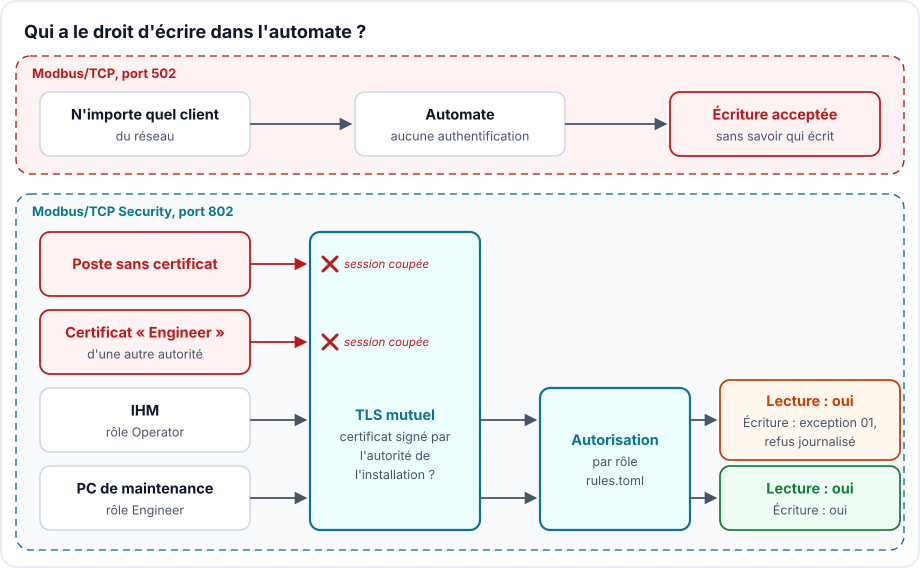

# Modbus ne demande jamais « qui est là ? » : TLS mutuel et rôles

> **CRA & Dev #7** · [Série « CRA & Dev »](index.md) · Lecture : environ 7 min · Industriel, Modbus ·
> Exemple : Python (pymodbus)

## Ce que demande le CRA

Le [Cyber Resilience Act][cra] demande qu'un produit assure la protection contre
l'accès non autorisé par des mécanismes de contrôle appropriés, comme
l'authentification ou la gestion des identités et des accès, et qu'il signale les
accès non autorisés possibles (Annexe I, partie I, point 2, d). Il demande aussi une
configuration sécurisée par défaut (point b), une surface d'attaque limitée, y
compris pour les interfaces externes (point j), et la protection des données et des
commandes transmises (points e et f).

Pour un automate, un variateur ou un contrôleur d'axes qui parle Modbus, la question
est simple : quand une commande arrive sur le port réseau, le produit sait-il qui
l'envoie, et a-t-il le droit de la refuser ?

## Le piège classique

Modbus/TCP n'a ni mot de passe ni notion d'utilisateur. Tout client qui atteint le
port 502 peut lire et écrire ce que l'appareil expose. Ce n'est pas un défaut
d'implémentation : le protocole est conçu ainsi, et les passerelles qui transportent
du Modbus série sur Ethernet héritent du même comportement.

Les conséquences sont documentées. Le logiciel malveillant FrostyGoop, analysé par
[Dragos][dragos], agit sur les équipements industriels en Modbus TCP sur le port 502 ;
utilisé contre un réseau de chaleur en Ukraine, il a privé les clients de chauffage
pendant deux jours. Les avis de sécurité suivent le même motif, par exemple la
[CVE-2025-48466][cve-advantech] : un attaquant distant non authentifié envoie des
trames Modbus TCP et pilote les sorties d'un module d'E/S.

Le réflexe « notre réseau est isolé » ne tient pas longtemps : un poste de
maintenance, un routeur d'accès distant ou un PC de supervision compromis suffit à
atteindre le port 502 de l'intérieur.

## La technique : Modbus/TCP Security

Modbus.org a spécifié une version sécurisée du protocole, [Modbus/TCP
Security][mbsec] (« mbaps »), sur le port 802 [enregistré à l'IANA][iana] sous le nom
`mbap-s`. Les trames Modbus ne changent pas : elles passent dans une session TLS.
Les exigences clés :

- TLS 1.2 ou plus récent, sans repli vers une version plus ancienne (R-01, R-34) ;
- authentification mutuelle : le client présente lui aussi un certificat X.509, et
  l'appareil coupe la session s'il n'en présente pas (R-02, R-10) ;
- un rôle par certificat, dans l'extension `1.3.6.1.4.1.50316.802.1` (R-21, R-65) ;
- une autorisation par rôle, dont les règles sont configurables par l'utilisateur et
  sans rôle par défaut figé (R-27, R-28) ; une requête refusée reçoit l'exception
  Modbus 01, *Illegal function* (R-31).



Côté appareil, en Python avec [pymodbus][pymodbus], le cœur tient en peu de lignes.
D'abord la session TLS, qui exige un certificat client signé par l'autorité de
l'installation :

```python
ctx = ssl.SSLContext(ssl.PROTOCOL_TLS_SERVER)
ctx.minimum_version = ssl.TLSVersion.TLSv1_2   # R-01, R-34
ctx.verify_mode = ssl.CERT_REQUIRED            # R-02, R-10
ctx.load_cert_chain("plc.crt", "plc.key")
ctx.load_verify_locations("ca.crt")            # seuls nos clients entrent
```

Puis l'autorisation : le rôle est lu une fois, à l'ouverture de la session, et
chaque requête est comparée aux règles (extrait simplifié de `mbsec/plc.py`) :

```python
def callback_connected(self):
    der = self.transport.get_extra_info("ssl_object").getpeercert(binary_form=True)
    self.role = role_from_certificate(der)     # None si le certificat n'en a pas

async def handle_request(self):
    pdu = self.last_pdu
    if not self.server.rules.authorise(self.role, pdu.function_code):
        log.warning("DENIED %s from %s (role %s)", ...)    # signaler (CRA 2 d)
        self.server_send(ExceptionResponse(pdu.function_code, ExcCodes.ILLEGAL_FUNCTION), ...)
        return
    await super().handle_request()
```

Les règles vivent dans un fichier que l'exploitant peut modifier :

```toml
[roles.Operator]
functions = [1, 2, 3, 4]               # lectures seulement

[roles.Engineer]
functions = [1, 2, 3, 4, 5, 6, 15, 16] # lectures et écritures
```

La [démonstration][example] fait tourner deux automates simulés sur votre machine,
qui pilotent la broche d'une machine-outil : l'un en Modbus/TCP classique, l'autre
en Modbus/TCP Security seulement. Le premier cas rejoue sur une broche le geste de
FrostyGoop sur les régulateurs de chauffage : un client quelconque du réseau réécrit
la consigne, ici de 12 000 à 60 000 tr/min, et l'automate l'applique. La démonstration
se lance avec `uv run python -m mbsec.demo` ; extrait de la sortie :

```
1. Legacy PLC, plain Modbus/TCP: anyone on the network sets the spindle to 60000 rpm
   write: accepted
   spindle speed now: 60000 rpm
2. Secure PLC, Modbus/TCP Security only. Client without a certificate
   write: rejected, the PLC closed the TLS session
3. Client with an Engineer role, signed by its own CA
   write: rejected, the PLC closed the TLS session
4. Operator (HMI): may read, may not write
   read:  12000 rpm
   plc log: DENIED write single register from 127.0.0.1:36604 (role Operator)
   write: refused, Modbus exception 1 (Illegal function)
6. Engineer (maintenance laptop): may write
   write: accepted
   spindle speed now: 15000 rpm
```

Le troisième cas compte : n'importe qui peut fabriquer un certificat portant le rôle
`Engineer`. C'est la signature de l'autorité de l'installation qui lui donne de la
valeur.

## Quand l'appareil ne peut pas faire de TLS

Tous les produits n'ont pas la mémoire ou le processeur pour TLS, et beaucoup de
clients en place ne parlent que Modbus/TCP. Le CRA ne demande pas un protocole
précis ; il demande que l'accès non autorisé soit maîtrisé et que la configuration
par défaut soit sûre. À défaut de Modbus/TCP Security :

- livrer le service Modbus/TCP désactivé, à activer explicitement par l'exploitant
  (point b) ;
- le limiter à ce qui est nécessaire : lecture seule par défaut, interface réseau
  dédiée, liste blanche des adresses clientes (point j) ;
- documenter qu'il doit vivre dans une zone réseau cloisonnée, jamais exposée à
  Internet, et dire pourquoi : le protocole n'authentifie personne.

Une liste blanche d'adresses IP réduit l'exposition, mais n'authentifie pas : sur le
même réseau, une adresse se falsifie. C'est un complément, pas un équivalent du TLS
mutuel.

## Trois choses à savoir

1. Le vrai travail, c'est l'infrastructure de clés. Il faut une autorité de
   certification par installation ou par client, des certificats avec une date
   d'expiration et un moyen d'en retirer un, et la clé de l'autorité hors ligne ou
   dans un HSM, comme la clé de signature de l'[épisode 6](CRA-Dev-06-FUOTA-LoRaWAN.md).
   La spécification laisse cette gestion à la PKI de l'installation.
2. La spécification prévoit une suite sans chiffrement. Un serveur devrait pouvoir
   activer `TLS_RSA_WITH_NULL_SHA256` (R-67), qui authentifie et protège l'intégrité
   sans chiffrer. Si vous l'activez, les données transitent en clair : la
   confidentialité demandée au point e n'est plus assurée.
3. TLS ne protège pas d'un client légitime compromis. Un poste de maintenance piraté
   présente un certificat valide avec le rôle `Engineer`, et ses écritures seront
   acceptées. Les rôles limitent les dégâts, d'autant plus s'ils restreignent aussi
   les plages d'adresses, et le journal des refus (CRA, point d) aide à repérer qu'un
   client sort de son rôle. Une session TLS refusée n'atteint jamais Modbus : c'est à
   la couche TLS du produit de la journaliser.

## À retenir

Modbus/TCP exécute ce qu'on lui envoie, sans demander qui l'envoie. Modbus/TCP
Security pose la question au bon endroit : un certificat signé par l'installation
pour entrer, un rôle dans ce certificat pour décider de chaque requête, un refus
journalisé quand le rôle ne suffit pas. Quand l'appareil ne peut pas faire de TLS, le
service doit au moins être éteint par défaut, restreint et cloisonné. C'est ce qui
répond à l'exigence de protection contre l'accès non autorisé du CRA.

---

*Épisode précédent : [Mille fragments, une seule signature, mettre à jour un
firmware par LoRaWAN](CRA-Dev-06-FUOTA-LoRaWAN.md).*

*Code d'accompagnement, dans [`examples/07-modbus-tls`][example] : les deux automates
simulés, la démonstration et ses tests.*

[cra]: https://eur-lex.europa.eu/eli/reg/2024/2847/oj?locale=fr
[mbsec]: https://www.modbus.org/file/secure/modbussecurityprotocol.pdf
[iana]: https://www.iana.org/assignments/service-names-port-numbers/service-names-port-numbers.xhtml?search=mbap-s
[dragos]: https://www.dragos.com/blog/protect-against-frostygoop-ics-malware-targeting-operational-technology/
[cve-advantech]: https://www.cve.org/CVERecord?id=CVE-2025-48466
[pymodbus]: https://pymodbus.readthedocs.io/
[example]: https://github.com/ADNTIO/cra-dev-wiki/tree/main/examples/07-modbus-tls
