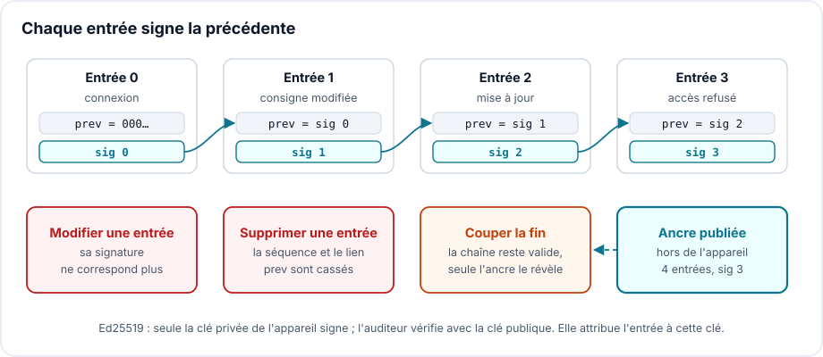

# Un journal qui ne peut pas mentir : chaîner et signer ses logs

> **CRA & Dev #7** · [Série « CRA & Dev »](index.md) · Lecture : environ 6 min · Multiplateforme ·
> Exemple : Python (cryptography)

## Ce que demande le CRA

Le [Cyber Resilience Act][cra] demande qu'un produit fournisse des informations de
sécurité en enregistrant et en surveillant son activité interne pertinente, y compris
l'accès aux données, services ou fonctions et leur modification, avec un mécanisme
de désactivation pour l'utilisateur (Annexe I, partie I, point 2, l).

Pour un développeur : qui s'est connecté, qui a changé une consigne, qui a mis à jour
le firmware, qui s'est vu refuser un accès. Et ce journal doit rester digne de foi le
jour où l'on en a besoin, c'est-à-dire après une intrusion.

## Le piège classique

Un journal en texte brut, même horodaté, se réécrit. Un attaquant qui a pris la main
sur l'appareil efface ou corrige les lignes qui le trahissent. C'est une technique
répertoriée par [MITRE ATT&CK][mitre] : effacer les journaux d'événements Windows
avec `wevtutil cl`. NotPetya l'a fait à grande échelle en 2017 : d'après
l'[analyse de Talos][talos], le logiciel exécutait
`wevtutil cl Setup & wevtutil cl System & wevtutil cl Security & wevtutil cl Application`
sur chaque machine compromise.

Second piège : ajouter un hash à chaque ligne. L'attaquant modifie la ligne et
recalcule le hash, exactement comme pour le fichier de
l'[épisode 4](CRA-Dev-04-Integrite.md). Un hash détecte une corruption, pas une
falsification.

## La technique : chaîner et signer

Chaque entrée embarque la signature de l'entrée précédente, puis est signée à son
tour :

```
entrée n = { seq: n, heure, événement, prev: signature de l'entrée n-1, sig }
```

Modifier une entrée invalide sa signature. Supprimer ou insérer une entrée casse le
numéro de séquence ou le lien `prev`. Pour réécrire le passé sans être vu, il
faudrait la clé de signature.



En Python, avec Ed25519 de la bibliothèque [cryptography][cryptography] (extrait
simplifié de `chainlog/log.py`) :

```python
def append(self, **event):
    record = {"seq": self.count, "time": now(), "event": event, "prev": self.last}
    record["sig"] = self.signer.sign(signed_part(record)).hex()
    self.path.open("a").write(json.dumps(record) + "\n")
    self.count, self.last = self.count + 1, record["sig"]
```

Reste un angle mort : couper la fin du journal. La chaîne restante est valide. Le
remède est une ancre, le nombre d'entrées et la dernière signature, publiée
régulièrement hors de l'appareil, sur un serveur de journaux par exemple. La
[démonstration][example] le montre :

```
2. Attacker edits entry 1 (hides who changed the spindle speed)
   verify: TAMPERING DETECTED, entry 1: bad signature (entry modified)
3. Attacker deletes entry 2 (hides the firmware update)
   verify: TAMPERING DETECTED, entry 2: sequence jumps to 3 (entry removed or inserted)
4. Attacker cuts the last 2 entries
   chain alone: OK
   with anchor: TAMPERING DETECTED, log ends at 3 entries, the anchor says 5 (end truncated)
```

## La non-répudiation, ou pourquoi une signature et pas un HMAC

Trois niveaux de preuve :

- une chaîne de hashs détecte une modification, mais n'importe qui peut en
  recalculer une nouvelle : elle ne dit rien de l'auteur ;
- un HMAC chaîné prouve que le journal vient d'un détenteur de la clé. Mais celui qui
  vérifie détient la même clé, et peut donc fabriquer une entrée valide. L'appareil
  pourra toujours nier ;
- une signature Ed25519 ne peut venir que du détenteur de la clé privée, restée sur
  l'appareil. L'auditeur ne vérifie qu'avec la clé publique. L'appareil ne peut pas
  nier avoir écrit l'entrée : c'est la non-répudiation.

La démonstration le fait voir : une fausse entrée signée avec la clé HMAC partagée
passe la vérification, alors qu'un auditeur qui ne détient que la clé publique ne
peut rien signer.

## Trois choses à savoir

1. Sur Linux, l'outil existe déjà. `journalctl --setup-keys` active le
   [Forward Secure Sealing][journalctl] de systemd-journald : une clé de scellement
   reste sur la machine, la clé de vérification se garde ailleurs, et
   `journalctl --verify` contrôle l'authenticité. La clé de scellement change à
   intervalle régulier, 15 minutes par défaut : plus l'intervalle est court, plus la
   période pendant laquelle une altération passe inaperçue est courte
   ([`Seal=`][journald-conf]). Pour des journaux transmis en
   syslog, le [RFC 5848][rfc5848] définit des messages signés, avec un compteur qui
   révèle les messages manquants.
2. Tout repose sur la clé. Sur l'appareil, elle va dans un élément sécurisé ou un
   TPM, au minimum dans un fichier que seul le service de journalisation peut lire.
   Une clé qui ne change jamais permet à qui la vole de réécrire tout l'historique ;
   une clé qui évolue limite les dégâts à la période en cours.
3. La désactivation que demande le CRA ne doit pas devenir un trou. Le texte ne dit
   pas comment l'offrir ; nous recommandons d'inscrire la désactivation elle-même,
   avec son auteur, comme dernière entrée signée de la chaîne. On sait alors quand et
   par qui la surveillance a été coupée, et ce n'est pas un attaquant qui l'a fait en
   silence.

## À retenir

Un journal ne vaut que s'il résiste à celui qu'il doit confondre. Chaîner chaque
entrée à la signature de la précédente rend visible toute modification, suppression
ou insertion ; une ancre publiée ailleurs révèle la troncature ; une signature
asymétrique ajoute la non-répudiation, qu'un HMAC ne peut pas donner. C'est ce qui
transforme la journalisation exigée par le CRA en preuve.

---

*Épisode précédent : [Mille fragments, une seule signature, mettre à jour un
firmware par LoRaWAN](CRA-Dev-06-FUOTA-LoRaWAN.md).*

*Code d'accompagnement, dans [`examples/07-secure-logging`][example] : le journal
chaîné et signé, la démonstration et ses tests.*

[cra]: https://eur-lex.europa.eu/eli/reg/2024/2847/oj?locale=fr
[mitre]: https://attack.mitre.org/techniques/T1685/005/
[talos]: https://blog.talosintelligence.com/worldwide-ransomware-variant/
[cryptography]: https://cryptography.io/en/latest/hazmat/primitives/asymmetric/ed25519/
[journalctl]: https://www.freedesktop.org/software/systemd/man/latest/journalctl.html
[journald-conf]: https://www.freedesktop.org/software/systemd/man/latest/journald.conf.html
[rfc5848]: https://www.rfc-editor.org/rfc/rfc5848
[example]: https://github.com/ADNTIO/cra-dev-wiki/tree/main/examples/07-secure-logging
