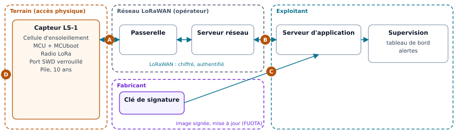

# Évaluer les risques de cybersécurité d'un produit

> **CRA & Dev #8** · [Série « CRA & Dev »](index.md) · Lecture : environ 8 min · Toutes plateformes ·
> Exemple : deux évaluations en Markdown et en PDF

## Ce que demande le CRA

Avant de signer un binaire ou de chiffrer un secret, il faut savoir contre quoi on se
protège. C'est le rôle de l'évaluation des risques, et le [Cyber Resilience Act][cra]
en fait le point de départ de tout le reste : c'est elle qui dit quelles exigences de
l'Annexe I s'appliquent à votre produit, et comment vous y répondez.

L'article 13 précise ce qu'elle doit contenir, au minimum.

- **Une analyse des risques**, « fondée sur l'utilisation prévue et l'utilisation
  raisonnablement prévisible, ainsi que sur les conditions d'utilisation » : où le
  produit sera installé, ce qu'il faut protéger, combien de temps il servira
  (paragraphe 3).
- **Un passage en revue des exigences de l'Annexe I**, partie I, point 2, de a à m :
  pour chacune, dites si elle s'applique et comment vous la mettez en œuvre. Si vous
  en écartez une, il faut une « justification claire » (paragraphes 3 et 4).
- **La façon dont vous appliquez** le point 1 de la partie I (un niveau de sécurité
  adapté aux risques) et la gestion des vulnérabilités de la partie II
  (paragraphe 3).
- **Un document vivant** : il guide le produit de la conception à la maintenance
  (paragraphe 2), rejoint la documentation technique (paragraphe 4), et reste à jour
  pendant toute la période d'assistance, c'est-à-dire la durée pendant laquelle vous
  traitez les vulnérabilités du produit : au moins cinq ans, sauf si le produit est
  prévu pour servir moins longtemps (paragraphes 3 et 8).

En revanche, le règlement n'impose aucune méthode. À vous de choisir celle qui
convient à votre produit, et c'est l'objet de la suite.

## Le piège classique

On télécharge un modèle, on le remplit en une après-midi pour l'audit, et on n'y
touche plus. Le document décrit « un produit connecté » en général, pas le vôtre, et
il est déjà faux à la version suivante. Une évaluation utile est l'inverse : courte,
propre à votre produit, et rangée dans le dépôt, à côté du code qu'elle justifie.

## La démarche en quatre questions

Le [Threat Modeling Manifesto][tmm] ramène toute la démarche à quatre questions
simples. Bonne nouvelle : en y répondant, vous couvrez ce que demande l'article 13.

1. **Sur quoi travaillons-nous ?** Décrivez le produit tel qu'il sera vraiment
   utilisé, y compris de travers : dans quel environnement (un atelier, un salon, un
   poteau en plein air), avec quels actifs à protéger (le firmware, les clés, les
   données, la fonction essentielle) et pour combien d'années. Dessinez les flux de
   données et les frontières de confiance : une page suffit.
2. **Qu'est-ce qui peut mal tourner ?** Reprenez chaque interface et chaque flux du
   schéma, et demandez-vous qui pourrait s'en servir contre vous. Une grille aide à
   ne rien oublier : [STRIDE][stride] passe en revue six familles de menaces
   (usurpation, altération, répudiation, divulgation, déni de service, élévation de
   privilèges). Pour un appareil embarqué, complétez avec le catalogue
   [EMB3D][emb3d] du MITRE.
3. **Que faisons-nous ?** Cotez chaque risque selon sa vraisemblance et son impact ;
   trois niveaux suffisent. Puis tranchez : soit une mesure, que vous rattachez au
   point de l'Annexe I qu'elle couvre, soit l'acceptation du risque, avec sa
   justification.
4. **Avons-nous bien travaillé ?** Faites relire l'analyse par quelqu'un qui ne l'a
   pas écrite. Puis remettez-la à jour à chaque version, et chaque fois qu'une
   vulnérabilité change la donne (article 13, paragraphe 7).

### Trouver les frontières de confiance

Dessinez les blocs du système, puis regroupez-les selon qui les contrôle : le terrain,
où n'importe qui peut toucher l'appareil ; le réseau de l'opérateur ; les serveurs de
l'exploitant ; le poste du fabricant. Chaque flèche qui traverse un pointillé franchit
une frontière de confiance. C'est là que se logent la plupart des menaces, et c'est
là que vous appliquez la grille STRIDE en premier.



Pour ce capteur LoRaWAN, on en compte quatre :

- **A**, la liaison radio entre le capteur et la passerelle : n'importe qui peut
  écouter, brouiller ou émettre ;
- **B**, l'arrivée des données chez l'exploitant : le réseau de l'opérateur est un
  tiers ;
- **C**, l'arrivée d'une mise à jour signée par le fabricant ;
- **D**, l'accès physique au capteur, sur son mât.

## Choisir une méthode

| Méthode | Ce que c'est | Quand la choisir | Accès |
| --- | --- | --- | --- |
| [STRIDE][stride] (Microsoft) | Grille de six catégories de menaces, appliquée au schéma des flux | Point de départ de toute équipe de développement | Libre |
| [EMB3D][emb3d] (MITRE) | Base de menaces et de mesures propres aux appareils embarqués | Firmware et matériel, en complément de STRIDE | Libre |
| [LINDDUN][linddun] | Menaces sur la vie privée | Produit qui traite des données personnelles | Libre |
| [EBIOS Risk Manager][ebios] (ANSSI) | Méthode complète en cinq ateliers, des sources de risque aux scénarios opérationnels | Produit critique, dossier à argumenter devant une direction ou des clients | Libre, FR et EN |
| [NIST SP 800-30][nist] | Guide générique : vocabulaire, échelles, déroulé | Structurer les cotations et le vocabulaire | Libre |
| [IEC 62443-4-1][iec] | Cycle de développement sécurisé ; l'exigence SR-2 demande un modèle de menaces par produit | Produit industriel, client qui exige IEC 62443 | Payant |
| [ISO/IEC 27005][iso] | Gestion des risques de la sécurité de l'information | Risques de l'organisation (SMSI ISO 27001) plutôt que du produit | Payant |
| [EN 40000-1-2][en40000] | Norme harmonisée horizontale du CRA : principes, gestion des risques produit, activités du cycle de vie | Viser la présomption de conformité, une fois la norme publiée | En approbation |

**Comment choisir ?**

- **C'est votre premier exercice, et l'équipe est petite** : commencez par les
  quatre questions et STRIDE, avec EMB3D si le produit est embarqué. Quelques heures
  suffisent pour une première version qui répond à ce que demande l'article 13.
- **Le produit traite des données personnelles** : ajoutez LINDDUN.
- **Vous vendez à l'industrie** : partez d'IEC 62443-4-1, que vos clients
  connaissent déjà.
- **Le produit est critique, ou vous devez convaincre une direction ou des
  clients** : EBIOS RM vous donne un cadre complet et un dossier argumenté.
- **Vous visez la présomption de conformité** : un produit conforme à une norme
  harmonisée dont la référence est publiée au Journal officiel est présumé conforme
  aux exigences qu'elle couvre (article 27). EN 40000-1-2 est encore en
  approbation ; le CEN-CENELEC prévoit sa disponibilité pour le 25 novembre 2026.

## Un modèle à copier

Gardez-le en Markdown dans le dépôt : il sera relu dans les pull requests, comme le
code.

```markdown
# Évaluation des risques : <produit> <version>

## 1. Contexte
- Usage prévu :
- Usage raisonnablement prévisible :
- Environnement d'utilisation :
- Actifs à protéger :
- Durée d'utilisation prévue, période d'assistance :
- Interfaces et flux (schéma) :

## 2. Risques
| # | Menace : qui, par où | Vraisemblance | Impact | Décision | Mesure ou justification |
| --- | --- | --- | --- | --- | --- |

## 3. Annexe I, partie I, point 2
| Point | Applicable ? | Mise en œuvre, ou justification si non applicable |
| --- | --- | --- |
| a) pas de vulnérabilité exploitable connue | | |
| … | | |
| m) effacement des données et réglages | | |

## 4. Annexe I, partie I, point 1, et partie II
- Niveau de cybersécurité visé et pourquoi :
- Gestion des vulnérabilités (SBOM, contact, mises à jour) :

## 5. Historique
| Date | Version | Changement |
| --- | --- | --- |
```

!!! example "Un exemple complet : le capteur d'ensoleillement LoRaWAN"

    L'évaluation complète d'un capteur LoRaWAN fictif, remplie avec ce modèle :
    contexte, schéma, sept risques, tableau de l'Annexe I.
    [Lire en ligne](ressources/exemples/evaluation-risques-capteur-ensoleillement.md) ·
    [PDF](ressources/exemples/evaluation-risques-capteur-ensoleillement.pdf)

    Pour comparer, la même démarche sur un produit à plus fort enjeu, une sonde de
    niveau d'eau pour réservoirs publics, dont peut dépendre une réserve incendie :
    [lire en ligne](ressources/exemples/evaluation-risques-sonde-niveau-eau.md) ·
    [PDF](ressources/exemples/evaluation-risques-sonde-niveau-eau.pdf).
    Les sources en Markdown sont dans [`examples/08-risk-assessment`][example].

## À retenir

L'évaluation des risques n'est pas un document de plus : c'est celui qui justifie
tous les autres. Quatre questions, une grille de menaces, un tableau des exigences de
l'Annexe I, le tout tenu à jour dans le dépôt : voilà ce que demande l'article 13.
Quant à la méthode, choisissez-la selon votre produit et vos clients.

---

*Épisode précédent : [Qui a fait quoi, et quand ? Journaliser l'activité de
sécurité](CRA-Dev-07-Security-Logs.md).*

*Code d'accompagnement, dans [`examples/08-risk-assessment`][example] : les deux
évaluations d'exemple en Markdown et le script qui produit leurs PDF.*

[cra]: https://eur-lex.europa.eu/eli/reg/2024/2847/oj?locale=fr
[tmm]: https://www.threatmodelingmanifesto.org/
[stride]: https://learn.microsoft.com/fr-fr/azure/security/develop/threat-modeling-tool-threats
[emb3d]: https://emb3d.mitre.org/
[linddun]: https://linddun.org/
[ebios]: https://cyber.gouv.fr/publications/la-methode-ebios-risk-manager-le-guide
[nist]: https://csrc.nist.gov/pubs/sp/800/30/r1/final
[iec]: https://webstore.iec.ch/en/publication/33615
[iso]: https://www.iso.org/fr/standard/80585.html
[en40000]: https://standards.cencenelec.eu/ords/f?cs=1D72BA048927BF4E6076BA309587EA01A&p=CEN%3A110%3A%3A%3A%3A%3AFSP_PROJECT%2CFSP_ORG_ID%3A81335%2C2307986
[example]: https://github.com/ADNTIO/cra-dev-wiki/tree/main/examples/08-risk-assessment
