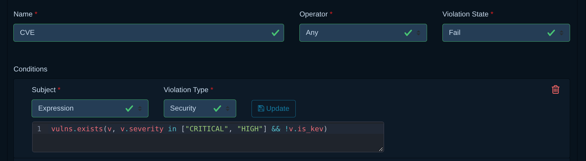
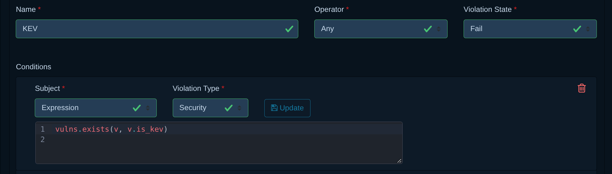
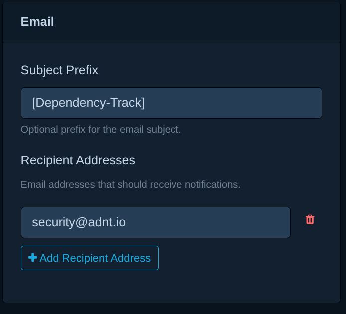
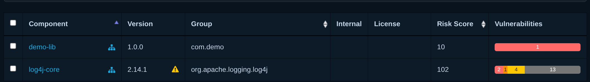

# Notifications CVE et KEV dans Dependency-Track

Ce guide met en place deux alertes e-mail dans Dependency-Track : une pour les CVE
critiques ou élevées, une pour les KEV.

Prérequis :

- Dependency-Track v5.1.1 ou plus (attribut `is_kev` disponible) ;
- un compte avec les permissions `POLICY_MANAGEMENT` et `SYSTEM_CONFIGURATION` ;
- les identifiants d'un serveur SMTP ;
- les projets déjà importés avec leur SBOM.

Chaîne mise en place :

```text
Vulnérabilité → Policy (CVE ou KEV) → Violation → Alerte filtrée → E-mail
```

## 1. Créer les policies

Pour chaque ligne du tableau :

1. **Policy Management → Create Policy**, saisir le `Name`, puis valider.
2. Déplier la policy créée, régler `Operator` et `Violation State`.
3. **Add Condition** : `Subject` = `Expression`, `Violation Type` = `Security`.
4. Coller l'expression, puis cliquer sur **Update** (sans ce clic, la condition
   n'est pas enregistrée).

| Name | Operator | Violation State | Expression |
|---|---|---|---|
| `CVE` | `Any` | `Fail` | `vulns.exists(v, v.severity in ["CRITICAL", "HIGH"] && !v.is_kev)` |
| `KEV` | `Any` | `Fail` | `vulns.exists(v, v.is_kev)` |

Le `!v.is_kev` de la policy CVE évite qu'une KEV déclenche deux alertes.

Sans projet ni tag associé (onglets **Projects** / **Tags** de la policy), la policy
s'applique à tout le portefeuille : c'est le comportement voulu ici.

Résultat attendu :

=== "Policy CVE"

    { loading=lazy }

=== "Policy KEV"

    { loading=lazy }

## 2. Configurer l'envoi d'e-mails

**Administration → Configuration → Email** :

| Champ | Valeur |
|---|---|
| Enable SMTP | coché |
| From address | adresse d'expédition autorisée par le serveur SMTP |
| SMTP server / port | ex. `smtp.example.com` / `587` |
| Username / Password | compte SMTP |
| SSL/TLS | coché si le serveur l'exige (port 465 ou 587 avec STARTTLS) |

Enregistrer, puis utiliser **Send test mail to** vers votre adresse. Ne pas passer à
la suite tant que ce mail n'est pas reçu.

Le template du publisher `Email` (**Administration → Notifications → Templates**)
fonctionne tel quel ; ne le modifier que pour changer le contenu du message.

## 3. Créer les alertes

**Administration → Notifications → Alerts → Create Alert**, une alerte par policy.
La fenêtre de création demande les quatre premiers champs ; les autres se règlent
ensuite en dépliant l'alerte dans la liste.

| Champ | Alerte CVE | Alerte KEV |
|---|---|---|
| Name | `CVE critique` | `KEV` |
| Scope | `Portfolio` | `Portfolio` |
| Notification level | `Informational` | `Informational` |
| Publisher | `Email` | `Email` |
| Groups | `Policy Violation` | `Policy Violation` |
| Filtre | `subject.policy_violation.condition.policy.name == 'CVE'` | `subject.policy_violation.condition.policy.name == 'KEV'` |
| Subject Prefix | `[Dependency-Track]` | `[Dependency-Track]` |
| Recipient Addresses | `security@adnt.io` | `security@adnt.io` |
| Enabled | coché | coché |

{ align=right width="300" loading=lazy }

Points d'attention :

- `Notification level` doit rester `Informational` : les violations de policy sont
  émises à ce niveau, un niveau plus élevé les ignore.
- Le filtre est obligatoire : sans lui, chaque violation part dans les deux alertes.
- Le nom dans le filtre doit correspondre exactement au `Name` de la policy (casse
  comprise).
- Cliquer sur **Add Recipient Address** pour chaque destinataire, puis enregistrer.

## 4. Tester

Les alertes ne partent que pour les violations **nouvelles**. Les créer avant
d'importer la SBOM de test.

1. **Projects → Create Project** : `demo-notif`.
2. Pour la CVE non KEV : **Vulnerabilities → Create Vulnerability**, créer une
   vulnérabilité interne de sévérité `Critical` affectant `pkg:maven/com.demo/demo-lib@1.0.0`.
3. Enregistrer la SBOM suivante dans `demo-notif.cdx.json` :

    ```json
    {
      "bomFormat": "CycloneDX",
      "specVersion": "1.5",
      "version": 1,
      "components": [
        {
          "type": "library",
          "group": "com.demo",
          "name": "demo-lib",
          "version": "1.0.0",
          "purl": "pkg:maven/com.demo/demo-lib@1.0.0"
        },
        {
          "type": "library",
          "group": "org.apache.logging.log4j",
          "name": "log4j-core",
          "version": "2.14.1",
          "purl": "pkg:maven/org.apache.logging.log4j/log4j-core@2.14.1"
        }
      ]
    }
    ```

4. Projet `demo-notif` → onglet **Components** → **Upload BOM**, choisir le fichier.
5. Attendre la fin de l'analyse (quelques minutes). L'onglet **Components** doit
   afficher des vulnérabilités sur les deux composants :

    { loading=lazy }

6. Vérifier la réception de deux e-mails : un de l'alerte CVE, un de l'alerte KEV.

### Dépannage

| Symptôme | Vérifier |
|---|---|
| Aucun e-mail | Mail de test SMTP (étape 2), case `Enabled` de l'alerte |
| Un seul e-mail | Onglet **Policy Violations** du projet : les deux policies sont-elles violées ? Si oui, relire le filtre de l'alerte manquante |
| Aucune violation | Conditions des policies bien enregistrées (bouton **Update**) |
| Violations présentes mais pas d'e-mail | Alertes créées après l'import : supprimer le projet et reprendre au point 1 |

Une fois le test validé, supprimer le projet `demo-notif` et la vulnérabilité interne.
